# KKL Forest - Master System Dossier (All-In-One)

> מסמך מאסטר יחיד הכולל: Executive Brief + System Overview מלא + Blueprint/Skeleton + Handoff Checklist.

---

## 1) Executive Summary

מערכת KKL Forest היא פלטפורמה ארגונית לניהול תפעול, כספים, ספקים, ציוד ודיווחים, עם שכבת אבטחה והרשאות מלאה.  
המערכת רצה כיום על **PostgreSQL/PostGIS** כבסיס נתונים runtime יחיד, לאחר תהליך התכנסות ממורשת SQL Server/Azure SQL.

### סטטוס ניהולי קצר
- Frontend: React + TypeScript + Vite + Tailwind.
- Backend: FastAPI + SQLAlchemy + Alembic.
- Auth: JWT Access/Refresh + OTP + Reset Password (single-use token policy).
- PWA: Manifest + Service Worker + התקנה בסיסית נתמכת.
- ארכיטקטורה ותהליכים מתועדים עם תרשימי זרימה ומדיניות מסירה.

---

## 2) System Scope and Business Domains

דומיינים מרכזיים במערכת:
- Identity & Access: משתמשים, תפקידים, הרשאות, sessions, OTP.
- Geography & Org: אזורים, יחידות, מיקומים, forests.
- Projects & Execution: פרויקטים, פקודות עבודה, worklogs.
- Suppliers: סבב הוגן, אילוצים, לוג אילוצים.
- Equipment: מלאי ציוד, סריקות, תחזוקה, שיוכים.
- Finance: תקציבים, פריטי תקציב, העברות, חשבוניות ותשלומים.
- Reporting & Governance: דוחות, report runs, activity logs, notifications, support tickets.

---

## 3) High-Level Architecture

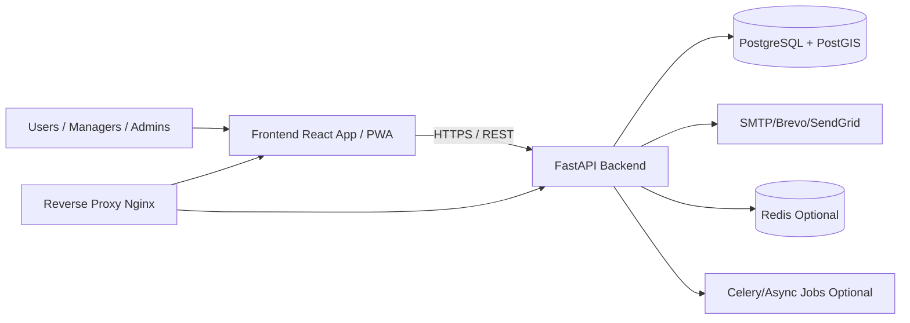

### Runtime components
- Frontend Web/PWA
- Backend API
- PostgreSQL database
- Optional Redis and workers
- Reverse proxy and environment-based deployment

---

## 4) Backend Architecture (Detailed)

מיקום: `app_backend/app`

### Layered structure
- `main.py` - bootstrap, middleware, app lifecycle
- `routers/` - REST endpoints לפי דומיין
- `services/` - לוגיקה עסקית
- `models/` - ORM entities
- `schemas/` - Pydantic contracts
- `core/` - config, security, db/session, dependencies, rate limiting, logging

### Backend responsibilities
- אימות, הרשאות וניהול סשנים
- ניהול טרנזקציות עסקיות
- ולידציה ושמירת נתונים
- Audit trail ולוג פעילות
- APIs תפעוליים, פיננסיים, ודוחות

---

## 5) Frontend Architecture (Detailed)

מיקום: `app_frontend/src`

### Key parts
- `main.tsx` - boot + providers + service worker registration
- `routes/index.tsx` - route graph + guards
- `services/api.ts` - Axios with auth/refresh interceptors
- `contexts/AuthContext.tsx` - auth bootstrap and state sync
- `utils/authStorage.ts` - remember-me aware storage policy

### Frontend responsibilities
- ניווט מבוסס Role/Permission
- תרחישי תפעול מרכזיים
- Auth UI flows: login/otp/forgot/reset
- Biometric readiness UX
- PWA installability baseline

---

## 6) Auth, Session, Security Flows

### 6.1 Login + Remember Me

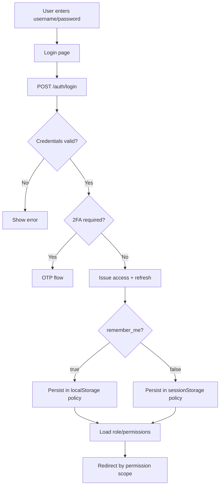

### 6.2 Auto Refresh

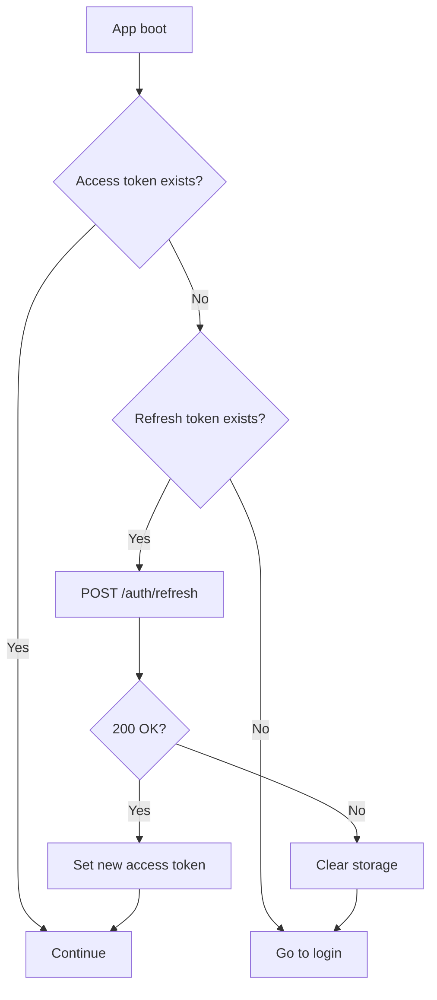

### 6.3 Forgot Password / Reset Password (single-use)

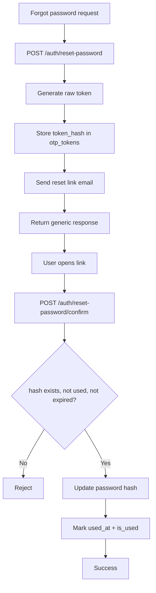

### 6.4 Security Baseline
- Password hashing policy
- JWT lifecycle and revoke/blacklist support
- Strict CORS/security headers in production
- API input validation
- Least-privilege DB user and migration governance

---

## 7) RBAC - Roles and Permissions

### Entities
- `roles`
- `permissions`
- `role_permissions`
- user-role mapping

### Enforcement
- Backend dependency checks לכל endpoint מוגן
- Frontend route/menu guards לפי permission codes
- לוג ניסיון גישה אסור

### Permission pattern
- `DOMAIN.ACTION` (example: `WORK_ORDERS.APPROVE`)

---

## 8) Database Architecture

### 8.1 Canonical database
- Runtime DB: **PostgreSQL + PostGIS**
- Schema evolution: **Alembic only**
- Policy: migration-first, no unmanaged manual drift

### 8.2 Core entity groups
- Identity: users/sessions/otp_tokens/token_blacklist/biometric_credentials
- Geography: regions/areas/locations/forests
- Ops: projects/work_orders/worklogs/worklog_segments
- Supplier: suppliers/rotations/constraint_reasons/constraint_logs
- Equipment: equipment/types/categories/scans/maintenance/assignments
- Finance: budgets/budget_items/transfers/balance_releases/invoices/invoice_items/invoice_payments
- Reporting/Admin: reports/report_runs/activity_logs/notifications/support_tickets/departments

### 8.3 ERD (high-level)

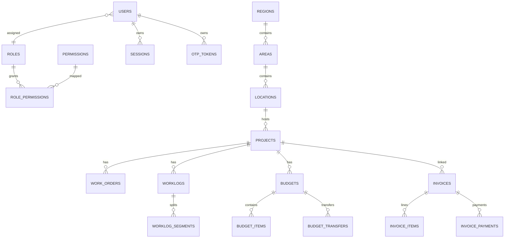

### 8.4 Migration and drift rules
- כל שינוי model מחייב migration
- migration כולל upgrade/downgrade
- בדיקות sequence/index/trigger לכל טבלת ליבה
- `alembic upgrade head` כחלק מגייט פריסה

---

## 9) SQL Server/Azure SQL -> PostgreSQL History

### Historical
- במערכת היו רכיבי legacy/scripts ל-SQL Server/Azure SQL.

### Current
- runtime סטנדרטי על PostgreSQL/PostGIS בלבד.
- legacy נשמר בארכיון (`app_backend/legacy/`) לתיעוד בלבד.

### Governance
- אין להחזיר runtime dependencies של mssql/pyodbc.
- תיקוני schema drift מבוצעים דרך Alembic.
- יש להקפיד owner/privileges נכונים למניעת חסימות migration.

---

## 10) Product Flows (Operational)

### 10.1 Work Order -> Worklog -> Approval

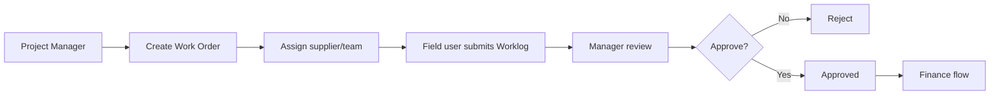

### 10.2 Budget -> Invoice -> Payment


### 10.3 Supplier Rotation with Constraints

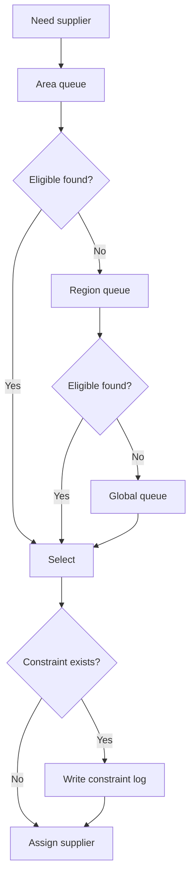

### 10.4 Reporting Flow

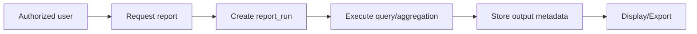

### 10.5 PWA Runtime

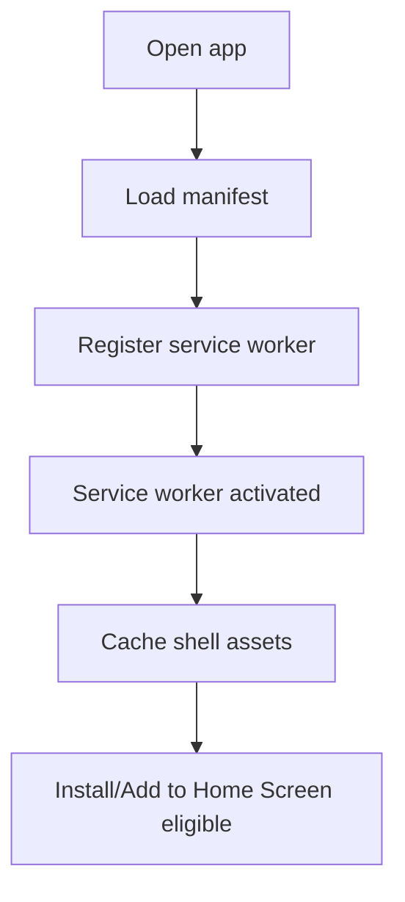

---

## 11) Infra, Environments, and Connectivity

### Environments
- local
- staging
- production

### Runtime defaults (example)
- backend: `8000`
- frontend dev: `5173`
- db: `5432`

### Connectivity and external services
- Reverse proxy to FE/API
- SMTP provider for auth/notifications
- Optional Redis and workers

### Secrets and config
- `.env` only for local dev
- secret manager in production
- no hardcoded credentials

---

## 12) Observability, Operations, and Runbook

### Observability
- structured logs
- request/trace id correlation
- app/db health checks
- audit logs for sensitive operations

### Runbook minimum
- local startup/teardown
- migrations run/verify
- rollback plan
- incident log inspection
- sequence drift recovery procedure

---

## 13) Security and Compliance Skeleton

- authentication and token lifecycle policies
- RBAC enforcement server-side
- secure password/reset handling (hash-only tokens for reset)
- rate limiting and abuse protection
- secure headers and CORS policy
- migration governance for finance/auth tables

---

## 14) Testing and Quality Gates

### Testing types
- unit tests
- integration tests (API + DB)
- E2E (UI + auth flows)

### Mandatory critical scenarios
- login + remember me
- refresh on app load
- forgot/reset password with single-use enforcement
- permission enforcement
- supplier rotation behavior
- finance operations end-to-end

### CI/CD gates
- lint/type checks
- test suite
- migration sanity (`upgrade head`)
- smoke checks post deploy

---

## 15) Current Status Snapshot (Management + Technical)

- מערכת מיושרת ל-PostgreSQL runtime.
- תועדו ונוהלו תיקוני drift משמעותיים דרך migrations.
- login phase core flows קיימים (remember/refresh/reset/PWA baseline).
- נדרש להמשיך משטר הוכחות DoD לכל שחרור.
- Biometric: נדרש אישור מוצר אם rollout מלא או readiness-only.

---

## 16) Repository Blueprint (Reference)

```text
repo/
  app_backend/
    app/{core,models,schemas,services,routers}
    alembic/versions
    tests/
  app_frontend/
    src/{routes,pages,components,services,contexts,utils}
    public/{manifest.webmanifest,sw.js,icons}
  deployment/
  SYSTEM_OVERVIEW_REPORT.md
  APP_SKELETON_FULL_BLUEPRINT.md
  MASTER_SYSTEM_DOSSIER.md
```

---

## 17) Handoff Acceptance Checklist (Integrated)

סמן לכל סעיף: `PASS` / `FAIL` / `N/A` + הוכחה.

### A) Governance & Scope
- [ ] A1 Scope מסירה ברור
- [ ] A2 בעלי תפקידים במסירה הוגדרו
- [ ] A3 ארכיטקטורה עדכנית מתועדת
- [ ] A4 שלד מערכת מלא מתועד
- [ ] A5 תמצית הנהלתית מאושרת

### B) Backend
- [ ] B1 endpoints קריטיים זמינים ומוגנים
- [ ] B2 שכבת service נקייה
- [ ] B3 error handling אחיד
- [ ] B4 אין תלות runtime ב-SQL Server
- [ ] B5 בדיקות backend עוברות בסביבת יעד

### C) Frontend
- [ ] C1 routing + guarded routes תקינים
- [ ] C2 session/login/logout יציבים
- [ ] C3 remember-me storage policy תקינה
- [ ] C4 loading/error/empty states קיימים
- [ ] C5 אין שגיאות קונסול קריטיות

### D) Authentication & Security
- [ ] D1 access/refresh TTL תקין
- [ ] D2 remember me behavior מאומת
- [ ] D3 אין 401 refresh loop
- [ ] D4 forgot/reset E2E תקין
- [ ] D5 reset token hash-only + single-use
- [ ] D6 rate limit/CORS/security headers תקינים

### E) RBAC
- [ ] E1 roles/permissions קיימים
- [ ] E2 enforcement backend-side
- [ ] E3 UI gating תקין
- [ ] E4 role-permission matrix קיים

### F) Database & Migrations
- [ ] F1 PostgreSQL source of truth
- [ ] F2 `alembic upgrade head` עובר
- [ ] F3 אין טבלאות ליבה חסרות
- [ ] F4 sequences/defaults תקינים
- [ ] F5 `updated_at` triggers פעילים כנדרש
- [ ] F6 אין drift ידוע פתוח

### G) Data Integrity
- [ ] G1 foreign keys בדומיינים קריטיים
- [ ] G2 unique constraints תקינים
- [ ] G3 audit/version/soft-delete קיימים לפי צורך
- [ ] G4 backfill תועד במיגרציות

### H) DevOps & Runtime
- [ ] H1 deployment runbook מעודכן
- [ ] H2 health checks פעילים
- [ ] H3 logging עם trace/request id
- [ ] H4 ניהול סודות תקין
- [ ] H5 rollback procedure מתועד

### I) PWA & Mobile
- [ ] I1 manifest תקין
- [ ] I2 service worker activated
- [ ] I3 Add to Home Screen נבדק
- [ ] I4 icons/splash baseline קיימים

### J) QA Evidence Pack
- [ ] J1 login success + redirect evidence
- [ ] J2 remember true/false storage evidence
- [ ] J3 refresh network evidence
- [ ] J4 reset success + reuse fail evidence
- [ ] J5 PWA application evidence
- [ ] J6 test/lint outputs attached

### K) Risks & Debt
- [ ] K1 known issues list מעודכנת
- [ ] K2 debt owners + deadlines
- [ ] K3 no handoff blocker open

---

## 18) Sign-Off

- Tech Lead: __________________  Date: __________
- QA Lead: ____________________ Date: __________
- DevOps Lead: ________________ Date: __________
- Product Owner: ______________ Date: __________

### Final Decision
- [ ] APPROVED FOR HANDOFF
- [ ] APPROVED WITH CONDITIONS
- [ ] NOT APPROVED

Conditions/Notes:

.............................................................................
.............................................................................
.............................................................................

---

## 19) Recommended Immediate Next Actions

- למלא את סעיף 17 לפי Evidence קיים בפועל.
- לצרף Role-Permission Matrix כנספח.
- לצרף API contract export כנספח.
- לנעול migration head מספרי לכל סביבה.

---

## 20) Repository Scan Findings (Current Gaps and Strengths)

סעיף זה משקף סריקה רוחבית עדכנית של כלל הריפו (Backend/Frontend/Deployment/Docs/Evidence), כדי לוודא שלא חסר שום דבר בתמונת המסירה.

### 20.1 Critical / High Priority Gaps

- Deployment עדיין לא ברמת enterprise מלאה: בתיקיית `deployment/` קיימים בעיקר `README.md` ו-`deploy.sh`, וחסרים ארטיפקטים תפעוליים מרכזיים (כגון `nginx.conf`, runbooks מלאים ל-rollback/backup/incident).
- כיסוי בדיקות frontend מוגבל: קיימים קבצי E2E בסיסיים ב-`app_frontend/tests/` אך חסר כיסוי unit/integration משמעותי בתוך `app_frontend/src/`.
- Type safety בפרונט חלש: קיימים קבצים רבים עם `@ts-nocheck`, כולל קבצי ליבה.
- אין Error Boundary גלובלי ברור שמגן מקריסות React לא מטופלות.
- Observability בבקאנד חלקי: קיימים לוגים ו-health checks, אך אין שכבת metrics/tracing מלאה ברמת production.
- מודול SMS קיים ב-`app_backend/app/core/sms.py`, אך מכיל placeholders וזרימת fallback שאינה אינטגרציית production סגורה.
- `AuthContext` דורש הקשחה נוספת (placeholder בלוגיקת `login` ותלות במבנה bootstrap עדין).

### 20.2 Confirmed Strengths (Present and Working Baseline)

- ארכיטקטורה מודולרית רחבה קיימת בפועל (routers/services/models/core).
- תשתית Alembic ומיגרציות קיימת ומנוהלת.
- PWA baseline קיים (`manifest.webmanifest`, `sw.js`, רישום service worker).
- Evidence Pack לשלב Login קיים תחת `evidence/login-step1/`.
- `app_backend/.env.example` קיים ומספק בסיס לקונפיגורציית סביבה.

### 20.3 Closure Plan for Identified Gaps

- גל 1: Error boundary + הקשחת `AuthContext` והורדת `@ts-nocheck` מקבצי ליבה.
- גל 2: השלמת חבילת deployment ops (runbooks, reverse-proxy config, backup/rollback procedures).
- גל 3: הרחבת test strategy לפרונט (unit/integration) + חיזוק observability.

---

## 21) Role-Permission Matrix (Handoff Baseline)

מקור האמת האופרטיבי הוא ה-DB (`roles`, `permissions`, `role_permissions`), אבל לצורך מסירה יש טבלת baseline קריאה:

Legend:
- `A` = full manage/admin
- `R` = read only
- `O` = operational subset
- `-` = no default access

| Role | Dashboard | Projects | Work Orders | Worklogs | Equipment | Suppliers | Finance | Reports | Users/Roles | Geography | System |
|---|---|---|---|---|---|---|---|---|---|---|---|
| ADMIN | A | A | A | A | A | A | A | A | A | A | A |
| REGION_MANAGER | R | A | A | O | O | O | R | R | - | A | - |
| AREA_MANAGER | R | O | A | O | O | O | R | R | - | O | - |
| WORK_MANAGER | R | O | A | A | O | O | - | R | - | - | - |
| ORDER_COORDINATOR | R | O | A | O | O | O | - | R | - | - | - |
| ACCOUNTANT | R | R | R | R | - | - | A | A | - | - | - |
| SUPPLIER_MANAGER | R | R | O | O | O | A | - | R | - | - | - |
| FIELD_WORKER | R | R | O | A | O | - | - | - | - | - | - |
| SUPPLIER | R | - | O (scope) | O (scope) | - | O (portal scope) | - | - | - | - | - |
| VIEWER | R | R | R | R | R | R | R | R | - | R | - |

SQL extraction (authoritative exact mapping):

```sql
SELECT
  r.code AS role_code,
  p.code AS permission_code
FROM role_permissions rp
JOIN roles r ON r.id = rp.role_id
JOIN permissions p ON p.id = rp.permission_id
WHERE rp.deleted_at IS NULL
  AND r.deleted_at IS NULL
  AND p.deleted_at IS NULL
ORDER BY r.code, p.code;
```

---

## 22) API Contract Export (Operational)

### Required handoff artifacts
- `openapi.json`
- `openapi.yaml` (optional but recommended)
- `postman-collection.json` (optional)

### Export commands

```bash
curl -sS "http://localhost:8000/openapi.json" -o "docs/api/openapi.json"
```

```bash
python -m json.tool "docs/api/openapi.json" > /dev/null
```

```bash
yq -P "." "docs/api/openapi.json" > "docs/api/openapi.yaml"
```

```bash
npx --yes openapi-to-postmanv2@latest \
  -s "docs/api/openapi.json" \
  -o "docs/api/postman-collection.json" \
  -p
```

### Export metadata to attach
- export datetime
- git commit/version
- environment (staging/production)

---

## 23) Deployment Runbooks (Integrated)

### 23.1 Rollback Runbook

1. Freeze deployments.
2. Identify `bad_release` and previous stable `good_release`.
3. Redeploy backend/frontend artifacts to `good_release`.
4. Verify:
   - `/health`
   - `/api/v1/health`
   - `/api/v1/health/db`
5. Validate critical paths (login + one write flow).
6. Monitor 30 minutes and open RCA.

### 23.2 Backup/Restore Runbook

- Daily full DB backup + periodic WAL/point-in-time capability.
- Before deployment: on-demand pre-release backup.
- Restore drill cadence: at least monthly on staging clone.
- Verify restored data via:
  - row-count sanity on core tables
  - login flow
  - one finance flow and one work-order flow

### 23.3 Incident Response Runbook

- SEV1/SEV2/SEV3 classification.
- First 15 minutes:
  1. incident channel
  2. incident commander
  3. impact scope
  4. deployment freeze
  5. evidence capture
- Stabilize via safe mitigation (scale/restart/rollback).
- Communicate every 15 minutes.
- Close with timeline + root cause + corrective actions.

---

## 24) Initial Baseline Status (PASS/OPEN Snapshot)

This snapshot is based on current repository scan and is intended as a starting point for formal sign-off.

- Architecture docs: `PASS`
- PostgreSQL runtime alignment: `PASS`
- Alembic migration governance present: `PASS`
- Auth core flows (login/refresh/reset): `PASS` with evidence package
- RBAC framework present: `PASS`, matrix now documented
- API contract export artifact in repo: `OPEN` (process defined, export file to generate)
- Deployment runbooks as formal files: `OPEN` (content integrated here, file-level ops package to finalize)
- Frontend ErrorBoundary: `OPEN`
- Frontend type-hardening (`@ts-nocheck` reduction): `OPEN`
- Frontend unit/integration tests: `OPEN`
- Observability (metrics/tracing/APM): `OPEN`

---

## 25) System Flow Map (Single Central View)

### 25.1 Unified Cross-System Flow (Mermaid)

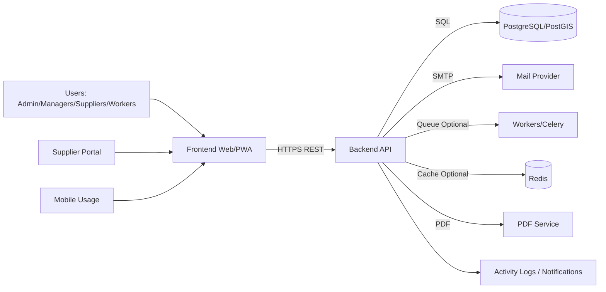

### 25.2 PNG Artifact

- Architecture image for handoff: `docs/diagrams/system-flow-map.png`

---

## 26) Top 6 Mandatory Business Flows

> כל זרימה: תרשים קצר + 5 חוקי הפעלה שמונעים אי-הבנות.

### 26.1 Login / Remember Me / Refresh / Logout

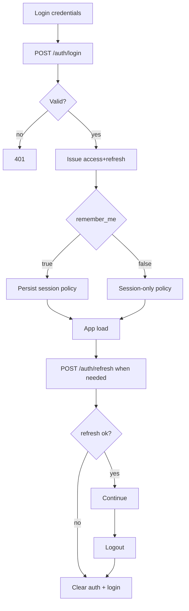

Rules:
- Access token קצר, refresh token לפי policy.
- `remember_me=true` חייב לשמר התמדה מעבר לסשן דפדפן.
- refresh כושל מנקה auth state.
- לא לאפשר 401-loop אינסופי.
- logout חייב לבטל state לקוח + server-side session policy.

### 26.2 Forgot Password / Reset (Single-Use)

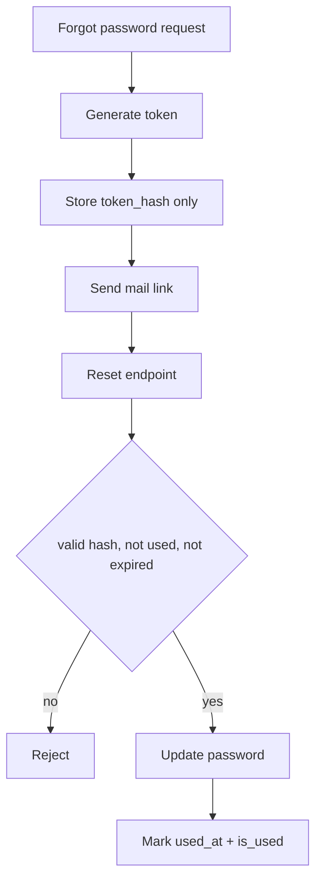

Rules:
- תגובה התחלתית גנרית למניעת user enumeration.
- לשמור hash בלבד, לא raw token.
- טוקן חד-פעמי בלבד.
- expiry קצר חובה.
- reset מוצלח חייב לבטל שימוש חוזר.

### 26.3 Work Order -> Supplier Portal -> Approve/Reject -> Active

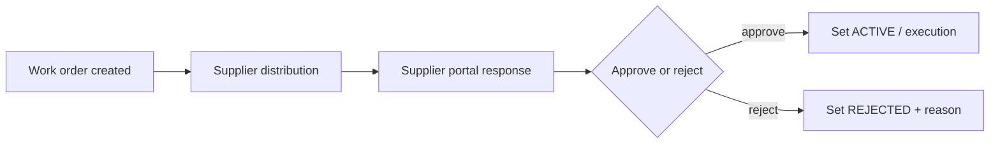

Rules:
- ספק מגיב רק להזמנה בהיקף הרשאה/טוקן תקף.
- דחייה חייבת לשמור reason auditable.
- אישור מעדכן סטטוס הזמנה בצורה אטומית.
- אסור מעבר ל-ACTIVE בלי תנאי pre-check (ספק/ציוד/תקציב כנדרש).
- כל מעבר סטטוס נרשם ב-activity log.

### 26.4 Equipment Scan -> Daily Report -> Approval PDF

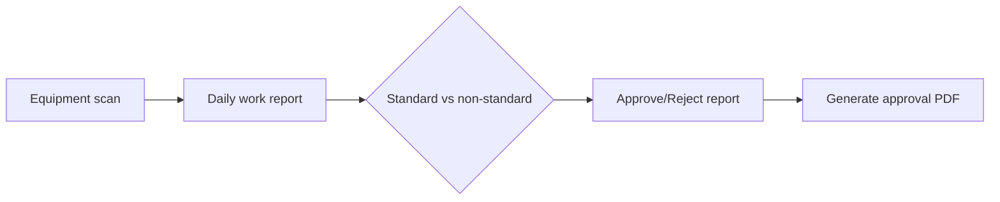

Rules:
- scan חייב להיקשר לציוד ומשתמש.
- daily report כולל שעות תקן/לא תקן.
- אישור/דחייה מחייב reviewer trail.
- PDF נוצר רק אחרי תנאי workflow תקין.
- דוח מאושר הופך לראיה תפעולית/חשבונאית.

### 26.5 Accountant Inbox (Area Scoped) -> Approve/Reject -> Mark for Invoice

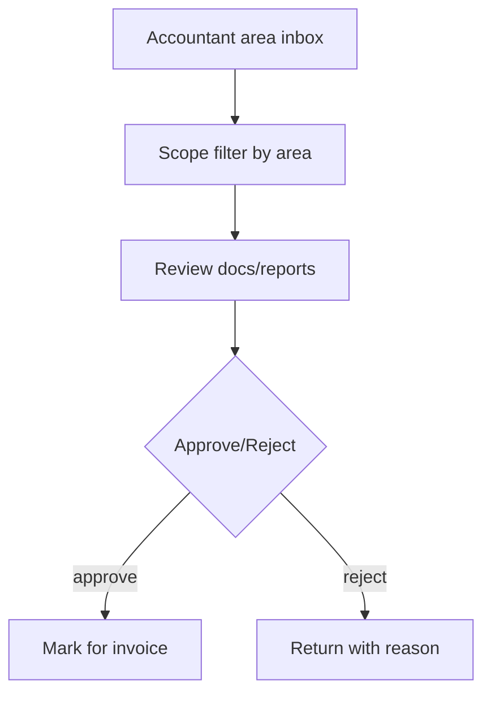

Rules:
- חייבים סינון scope לפי area (לא global by default).
- בדיקת scope גם ב-list וגם ב-get-by-id.
- דחייה מחייבת reason.
- סימון לחיוב מתאפשר רק אחרי approve.
- פעולת accountant נרשמת עם actor/timestamp.

### 26.6 Budget Reservation -> Release per Report -> Stop Early -> Release Remainder

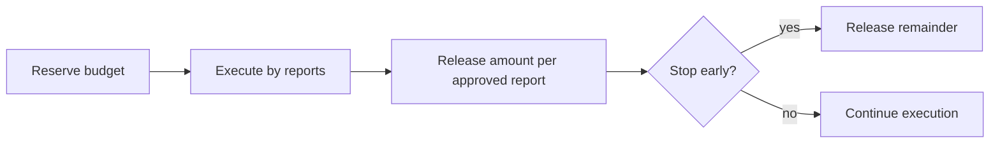

Rules:
- reservation נועל מסגרת תקציבית להזמנה.
- release מחושב לפי דיווחים מאושרים.
- עצירה מוקדמת משחררת יתרה לא מנוצלת.
- לא לאפשר חריגה מעבר למסגרת.
- כל תנועת תקציב auditable.

---

## 27) Data Lifecycle / State Machines

### 27.1 Work Order State Machine

Canonical statuses:
- `PENDING`
- `APPROVED`
- `ACTIVE`
- `COMPLETED`
- `REJECTED`
- `CANCELLED`

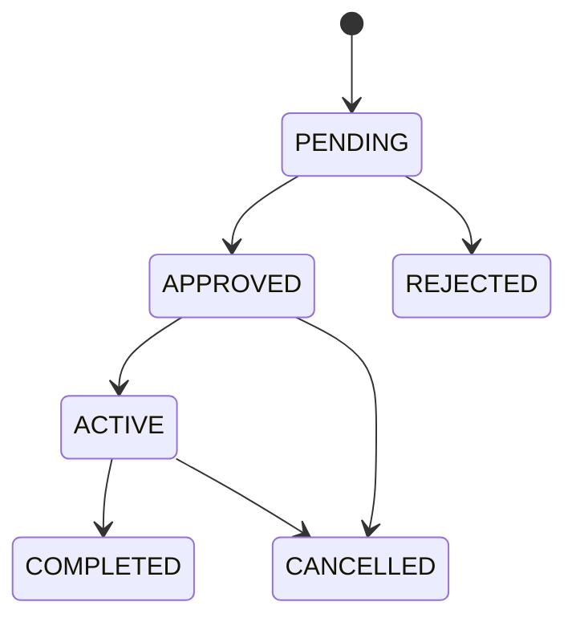

### 27.2 Worklog / Daily Report State Machine

Canonical daily report statuses:
- `draft`
- `submitted`
- `approved`
- `rejected`
- `processed`

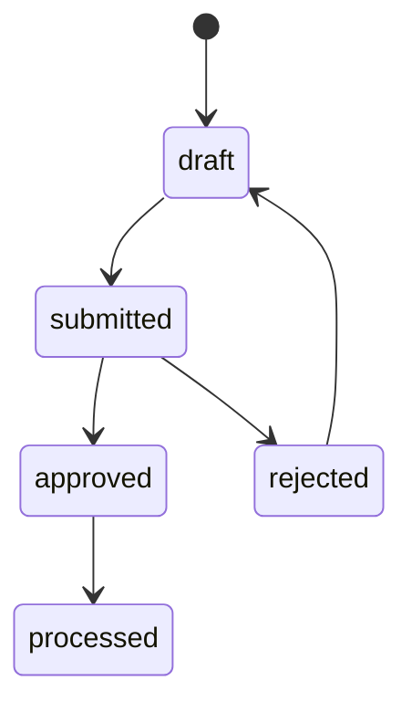

### 27.3 Approval Document State Machine (Operational Policy)

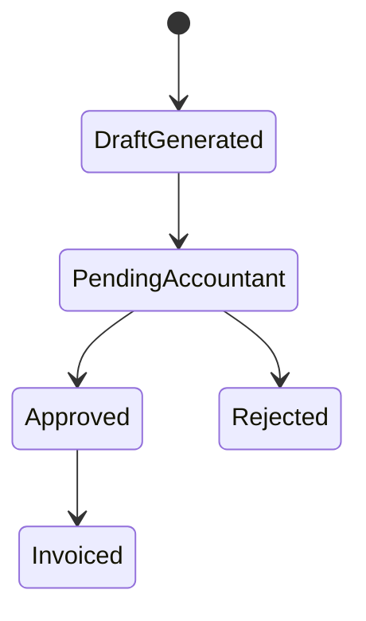

### 27.4 Invoice State Machine

Canonical invoice statuses:
- `DRAFT`
- `PENDING`
- `APPROVED`
- `PAID`
- `CANCELLED`

```mermaid
stateDiagram-v2
  [*] --> DRAFT
  DRAFT --> PENDING
  PENDING --> APPROVED
  APPROVED --> PAID
  DRAFT --> CANCELLED
  PENDING --> CANCELLED
```

---

## 28) RBAC Enforcement Proof

### 28.1 Backend enforcement mechanism

- Dependency and checker implementation: `app_backend/app/core/dependencies.py`
- Permission evaluation uses DB-backed role-permission mapping.
- `ADMIN` and `SYSTEM.ADMIN` are super-permission paths.

### 28.2 Endpoint examples (critical)

- Work Orders API checks: `app_backend/app/routers/work_orders.py`
  - uses `require_permission(current_user, "work_orders.read")`
  - uses `require_permission(current_user, "work_orders.approve")`
- Worklogs API checks: `app_backend/app/routers/worklogs.py`
  - uses `require_permission(current_user, "worklogs.read")`
  - uses `require_permission(current_user, "worklogs.approve")`

### 28.3 Area scope policy (mandatory)

Policy:
- list queries: enforce scope predicate
  - `WHERE project.area_id = user.area_id` for area-scoped roles
- get-by-id queries: repeat scope check after fetch (not list-only filtering)
- violation behavior: return `403` (forbidden) or `404` (hidden existence), by policy.

Existing scope reference:
- project access helper: `app_backend/app/core/dependencies.py` (`check_project_access`)

---

## 29) DB Source of Truth (Critical Subset)

### 29.1 Critical ERD: Finance + Approvals + Worklogs

```mermaid
erDiagram
  PROJECTS ||--o{ WORK_ORDERS : has
  WORK_ORDERS ||--o{ WORKLOGS : has
  WORKLOGS ||--o{ WORKLOG_SEGMENTS : split

  PROJECTS ||--o{ BUDGETS : has
  BUDGETS ||--o{ BUDGET_ITEMS : contains
  BUDGETS ||--o{ BALANCE_RELEASES : releases

  PROJECTS ||--o{ INVOICES : has
  INVOICES ||--o{ INVOICE_ITEMS : lines
  INVOICES ||--o{ INVOICE_PAYMENTS : payments

  USERS ||--o{ WORKLOGS : submits
  USERS ||--o{ BALANCE_RELEASES : approves
```

### 29.2 Table purpose list (critical path)

- `work_orders`: operational order lifecycle and assignment.
- `worklogs`: work execution reports and approval metadata.
- `daily_work_reports`: daily standard/non-standard reporting workflow.
- `budgets`: budget envelope per project/area scope.
- `budget_items`: budget line items and allocations.
- `balance_releases`: controlled budget release transactions.
- `invoices`: invoice headers and financial statuses.
- `invoice_items`: invoice line-level amounts.
- `invoice_payments`: payment events and processing actor.

### 29.3 Key constraints (representative)

- `work_orders.order_number` unique.
- `invoices.invoice_number` unique.
- critical FKs on work/budget/payment relations (model and migration managed).
- auth critical: `otp_tokens.user_id -> users.id`, unique token hash strategy for reset flow.

---

## 30) Ops Pack Files and Handoff Index

### 30.1 Ops pack target files

- `deployment/nginx.conf`
- `deployment/docker-compose.prod.yml`
- `deployment/RUNBOOK_DEPLOY.md`
- `deployment/RUNBOOK_ROLLBACK.md`
- `deployment/RUNBOOK_BACKUP_RESTORE.md`
- `deployment/RUNBOOK_INCIDENT.md`

### 30.2 Evidence index

- `EVIDENCE_INDEX.md` (single entry point for proofs + PASS/OPEN snapshot)

### 30.3 Known Issues + Roadmap ownership

- Gap ownership and wave plan tracked in:
  - Section 20 (gaps)
  - Section 24 (PASS/OPEN snapshot)
  - Wave closure path (Wave 1/2/3)
  - `KNOWN_ISSUES_ROADMAP.md`

### 30.4 Companion handoff docs added

- `docs/diagrams/SYSTEM_FLOW_MAP.md`
- `docs/diagrams/system-flow-map.png`
- `docs/flows/TOP6_MANDATORY_FLOWS.md`
- `docs/flows/STATE_MACHINES.md`
- `docs/rbac/ROLE_PERMISSION_MATRIX.md`
- `docs/rbac/RBAC_ENFORCEMENT_PROOF.md`
- `docs/db/DB_SOURCE_OF_TRUTH_FINANCE_APPROVALS_WORKLOGS.md`
- `docs/api/API_CONTRACT_EXPORT.md`

---

## 31) Supplier Constraint Laws (Authoritative)

To avoid ambiguity, these rules are mandatory:

1. If `is_forced_selection=true`, both are required:
   - `constraint_reason_id`
   - `constraint_notes` (non-empty, minimum meaningful length)
2. Supplier matching must be enforced by requested tool type/model (not broad category-only matching) as the target architecture.
3. Supplier master data must include geographic scope and tool inventory:
   - `region_id`
   - `area_id`
   - supplier tool inventory with `tool_type_id` and `license_plate`

Current implementation status:
- Rule 1: enforced in frontend and backend create flow.
- Rule 2/3: partially implemented today; full model-level enforcement requires schema completion for tool-type/model granularity and supplier geo/tool inventory structure.

---

## 32) Geo Validation Policy (3km Rule)

- A project is geographically consistent when `projects.location_geom` is **inside** `areas.geom` (`INSIDE`).
- If the project point is outside but within **<= 3,000 meters** from its area polygon, classify as `NEAR`.
  - Keep `area_id` unchanged for RBAC/business scope.
  - Flag for boundary/data review.
- If distance is **> 3,000 meters**, classify as `FAR`.
  - Treat as data integrity issue requiring correction (point and/or boundary).
- This policy is validation/flagging only and does not automatically change `area_id`.
- Current health snapshot: `INSIDE=57`, `NEAR=3`, `FAR=0` (no critical geo-assignment issues; 3 near-border items for manual review backlog).

### Geo Monitoring Policy

- `docs/db/geo_near_review.sql` — quarterly monitoring for near-border drift.
- `docs/db/geo_far_review.sql` — mandatory check before release and after data load/import.


