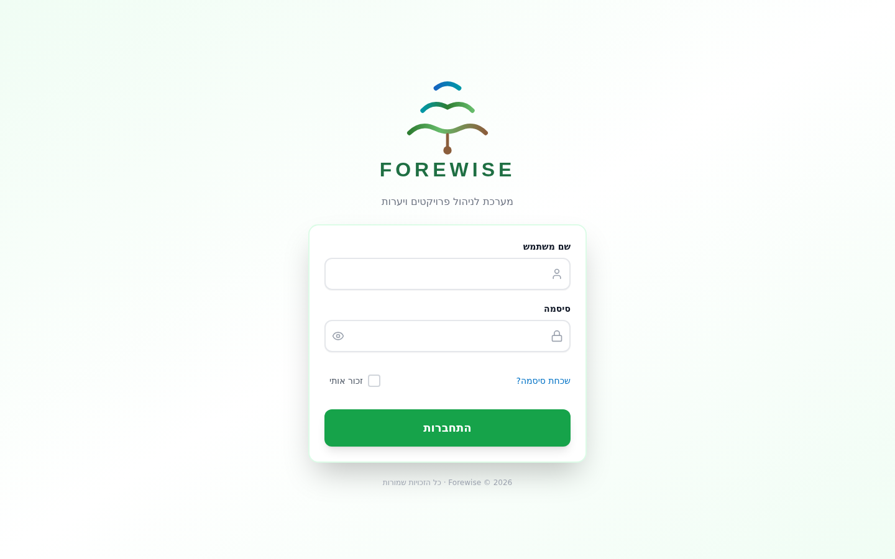
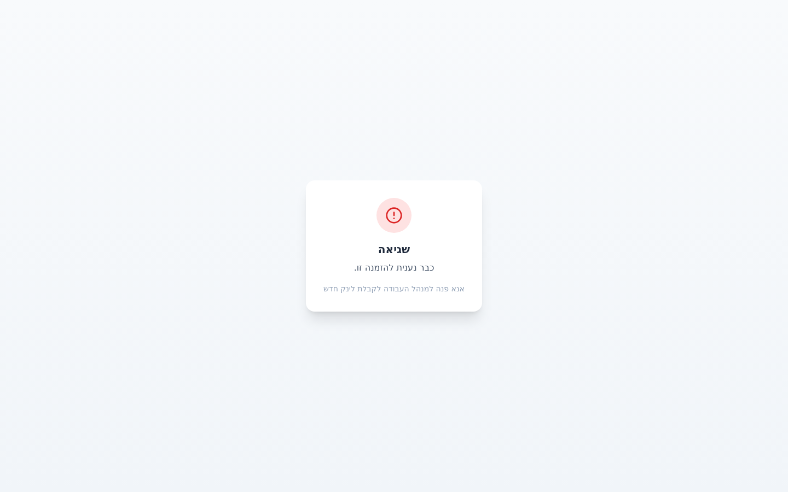
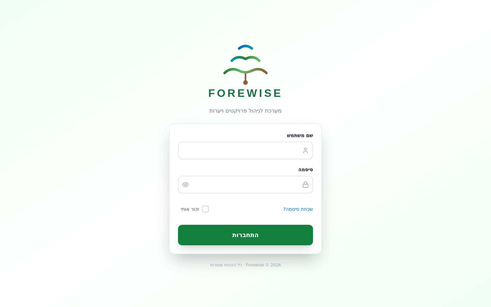

# נספחים — מערכת Forewise

---

# נספח א׳ — מסכי מערכת עיקריים

---

## 1. מסך התחברות (Login)

### תפקיד משתמש
כל המשתמשים — מנהלי מערכת, מנהלי מרחב, מנהלי אזור, מנהלי עבודה, רכזי הזמנות, מנהלות חשבונות.

### מטרה
הכניסה למערכת מבוססת על **שם משתמש וסיסמה** בלבד — לא על כתובת מייל.
לאחר אימות הסיסמה, המערכת מפעילה **אימות דו-שלבי (2FA) באמצעות קוד OTP** הנשלח למייל המשתמש.
ניתן לחלופין לבצע **אימות ביומטרי (WebAuthn)** — אפשרות זו זמינה למשתמשים שרשמו אמצעי ביומטרי מראש (Touch ID, Face ID, Windows Hello).

### פעולות עיקריות
- הזנת שם משתמש וסיסמה
- אישור OTP שנשלח למייל (2FA חובה)
- כניסה ביומטרית (אפשרות — אם נרשמה מראש)
- שכחתי סיסמה — איפוס באמצעות קוד OTP

### הערות
- לאחר 5 ניסיונות כושלים — החשבון ננעל אוטומטית ל-15 דקות.
- בסביבת Production, ממשק ה-API (docs/redoc) חסום לגמרי.

---

## 2. לוח בקרה (Dashboard)

### תפקיד משתמש
כל תפקיד רואה לוח בקרה מותאם — מנהל מערכת רואה מדדים כלל-מערכתיים, מנהל אזור רואה מדדים תפעוליים, מנהלת חשבונות רואה מדדים כספיים.

### מטרה
תצוגה מרכזית של מצב המערכת בזמן אמת — הזמנות פתוחות, דיווחים ממתינים לאישור, חריגות תקציב, התראות דחופות ופעולות מהירות.

### פעולות עיקריות
- צפייה ב-KPI מרכזיים (הזמנות פתוחות, דיווחים ממתינים, חריגות תקציב)
- ניווט מהיר לפעולות (יצירת הזמנה, אישור דיווח, צפייה בחשבוניות)
- צפייה בפעילות אחרונה ובהתראות

### הערות
כל KPI מותאם להרשאות — מנהל מרחב רואה רק נתוני המרחב שלו, מנהל אזור רואה רק את האזור שלו.

---

## 3. רשימת פרויקטים / סביבת עבודה

### תפקיד משתמש
מנהלי אזור, מנהלי עבודה, מנהלי מרחב.

### מטרה
ניהול פרויקטים פעילים — צפייה בסטטוס, תקציב, הזמנות פעילות ודיווחי עבודה.
סביבת העבודה של פרויקט כוללת לשוניות: סקירה כללית, הזמנות עבודה, כלים בפרויקט ומפה.

### פעולות עיקריות
- חיפוש וסינון פרויקטים
- כניסה לסביבת עבודה של פרויקט
- צפייה במפת יער ואזור עבודה (Leaflet + PostGIS)

---

## 4. יצירת הזמנת עבודה

### תפקיד משתמש
מנהל עבודה, מנהל אזור.

### מטרה
יצירת הזמנה חדשה עבור פרויקט — בחירת סוג ציוד, שיטת הקצאה (סבב הוגן / בחירה ידנית), תאריכי עבודה ותיאור.

### פעולות עיקריות
- בחירת פרויקט, סוג ציוד, שיטת הקצאה
- הגדרת תאריכי עבודה
- שליחה — ההזמנה נוצרת בסטטוס PENDING

### הערות
המערכת מוודאת שקיים תקציב זמין לפרויקט לפני יצירת ההזמנה. סוג הכלי חובה ומאומת מול קטגוריות קיימות.

---

## 5. ניהול הזמנות — מתאם הזמנות

### תפקיד משתמש
רכז הזמנות (Order Coordinator).

### מטרה
ניהול תור הזמנות — שליחה לספק, מעקב אחר תגובות, אישור סופי. המתאם שולט בזרימת ההזמנה מרגע היצירה ועד לאישור הסופי.

### פעולות עיקריות
- שליחת הזמנה לספק (יצירת קישור פורטל)
- מעקב אחר תגובת ספק (אישור / דחייה)
- אישור סופי של הזמנה (coordinator-approve)
- מעבר לספק הבא במקרה של דחייה

---

## 6. פורטל ספקים

### תפקיד משתמש
ספק חיצוני — גישה באמצעות קישור חד-פעמי בלבד, ללא צורך בהתחברות למערכת.

### מטרה
ספק מקבל קישור במייל עם token חד-פעמי (בתוקף 3 שעות). בפורטל הספק רואה את פרטי ההזמנה ויכול לאשרה עם בחירת כלי, או לדחותה.

### פעולות עיקריות
- צפייה בפרטי הזמנה (פרויקט, סוג ציוד, תאריכים)
- אישור הזמנה ובחירת כלי (מספר רישוי)
- דחיית הזמנה עם סיבה

### הערות
- קישור שפג תוקפו מציג הודעה ברורה.
- לא ניתן לאשר או לדחות פעמיים (מניעת כפילות).
- הפורטל מותאם לנייד.

---

## 7. אימות כלי לפי מספר רישוי

### תפקיד משתמש
מנהל עבודה (שטח).

### מטרה
אימות שהכלי שהגיע לשטח תואם את ההזמנה — על ידי הזנת מספר רישוי. המערכת בודקת: הכלי קיים, שייך לספק הנכון, ההזמנה מאושרת.

### פעולות עיקריות
- הזנת מספר רישוי (ראשי) או סריקת QR (משני)
- קבלת תוצאת אימות — תקין / לא תקין עם פירוט
- המשך לדיווח שעות

### הערות
אם הכלי שייך לספק שונה מהספק שאושר בהזמנה — מוצגת אזהרה. תומך בעבודה אופליין עם סנכרון אוטומטי.

---

## 8. דיווח שעות עבודה

### תפקיד משתמש
מנהל עבודה.

### מטרה
דיווח שעות עבודה בשטח — שעת התחלה, שעת סיום, הפסקות, תיאור עבודה. הדיווח מחושב אוטומטית (שעות נטו, עלות לפי תעריף).

### פעולות עיקריות
- הזנת תאריך, שעות, הפסקות
- תיאור הפעילות
- שליחה לאישור (סטטוס → SUBMITTED)

---

## 9. אישור דיווחים — מנהלת חשבונות

### תפקיד משתמש
מנהלת חשבונות.

### מטרה
תיבת עבודה כספית — סקירה ואישור דיווחי שעות שהוגשו. המנהלת רואה את כל הדיווחים הממתינים, עם סינון לפי פרויקט, ספק ותאריך.

### פעולות עיקריות
- סינון דיווחים ממתינים לפי פרויקט / ספק / תאריך
- צפייה בפירוט דיווח (שעות, עלות, ציוד)
- אישור או דחייה עם סיבה

### הערות
מנהלת חשבונות לא יכולה לאשר דיווח שיצרה בעצמה (self-approval blocked). גישה מוגבלת לאזור שלה בלבד.

---

## 10. חשבוניות

### תפקיד משתמש
מנהלת חשבונות.

### מטרה
ניהול מחזור החשבוניות — יצירה מדיווחים מאושרים, אישור וסימון כשולם. מספר חשבונית נוצר אוטומטית (INV-YYYY-NNNN).

### פעולות עיקריות
- יצירת חשבונית מדיווחים מאושרים
- אישור חשבונית (DRAFT → APPROVED)
- סימון כשולם (APPROVED → PAID)

### הערות
מעבר סטטוס חשבונית נאכף על ידי המערכת — לא ניתן לדלג על שלבים.

---
---

# נספח ב׳ — תהליכים עסקיים מרכזיים

---

## תהליך 1: יצירת הזמנת עבודה + שיבוץ ספק

### למה התהליך הזה קריטי
בארגון המנהל עשרות פרויקטים במקביל עם עשרות ספקים, חלוקת עבודה ידנית (טלפונים, וואטסאפ, אקסלים) גורמת לעיכובים, טעויות ואי-הוגנות. תהליך זה מחליף את התיאום הידני במנגנון אוטומטי: ההזמנה נוצרת, ספק נבחר בהגינות (סבב הוגן), ומקבל קישור מאובטח לאישור.

### איזו בעיה עסקית נפתרת
- ספקים מקבלים הזמנות בצורה שוויונית (Fair Rotation) — לא לפי קשרים אישיים
- מניעת שכחת הזמנות — token בתוקף 3 שעות, לאחר מכן מעבר אוטומטי לספק הבא
- שקיפות מלאה — כל שלב (שליחה, תגובה, אישור) מתועד ומנוטר

### קבצי Frontend
- `app_frontend/src/pages/WorkOrders/NewWorkOrder.tsx` — טופס יצירת הזמנה

### קבצי Backend
- `app_backend/app/services/work_order_service.py` — לוגיקה עסקית
- `app_backend/app/routers/work_orders.py` — API endpoints

### קטע קוד — Backend: יצירת הזמנה

    # app_backend/app/services/work_order_service.py
    def create_work_order(self, db, work_order, created_by_id):
        # Validate equipment type exists in categories table
        cat_row = db.execute(text(
            "SELECT id FROM equipment_categories WHERE LOWER(name) = LOWER(:n)"
        ), {"n": wo_dict.get("equipment_type")}).fetchone()
        if not cat_row:
            raise HTTPException(400, "סוג כלי לא נמצא במערכת")

        wo_dict['status'] = 'PENDING'          # Initial state
        wo_dict['portal_token'] = secrets.token_urlsafe(32)  # Supplier access token
        new_wo = WorkOrder(**wo_dict)
        db.add(new_wo)
        db.commit()
        return new_wo

### קטע קוד — Backend: שליחה לספק (כולל סבב הוגן)

    # app_backend/app/services/work_order_service.py
    def send_to_supplier(self, db, work_order_id, current_user_id):
        # If no supplier assigned — select via Fair Rotation
        if not work_order.supplier_id:
            selected = self._select_supplier_by_rotation(db, work_order)
            if not selected:
                raise ValidationException("לא נמצא ספק זמין")
            work_order.supplier_id = selected

        # Token valid for 3 hours only
        work_order.portal_token = secrets.token_urlsafe(32)
        work_order.portal_expiry = datetime.utcnow() + timedelta(hours=3)
        work_order.status = "DISTRIBUTING"
        db.commit()

        send_email(to=supplier.email, html_body=branded_html)  # Notify supplier

### זרימה

| שלב | קלט | עיבוד | פלט |
|-----|------|-------|-----|
| 1 | פרטי הזמנה (פרויקט, סוג ציוד) | ולידציה, בדיקת תקציב | PENDING |
| 2 | הזמנה + שיטת הקצאה | בחירת ספק (סבב הוגן / ידני) + מייל | DISTRIBUTING |
| 3 | תגובת ספק | עדכון סטטוס + שמירת ציוד | SUPPLIER_ACCEPTED_PENDING_COORDINATOR |
| 4 | אישור מתאם | אישור סופי | APPROVED_AND_SENT |

### מסד נתונים

**טבלה: work_orders** (שדות מרכזיים)

| שדה | סוג | תיאור | קשר |
|-----|-----|-------|-----|
| id | integer PK | מזהה | |
| order_number | integer NOT NULL | מספר הזמנה | |
| project_id | integer | פרויקט | → projects.id |
| supplier_id | integer | ספק | → suppliers.id |
| created_by_id | integer | יוצר | → users.id |
| status | varchar | מכונת מצבים | |
| portal_token | varchar | token גישה לספק | |
| portal_expiry | timestamp | תוקף ה-token | |
| allocation_method | varchar | fair_rotation / forced | |
| frozen_amount | numeric | סכום מוקפא מתקציב | |

[Insert DB Screenshot Here: work_orders_after_creation.png]

### סיכום תהליך
תהליך זה מבטיח שכל הזמנת עבודה עוברת מסלול מוגדר ושקוף — מיצירה, דרך בחירת ספק אוטומטית, ועד לאישור סופי. הסבב ההוגן מונע הטיה בבחירת ספקים, ומנגנון ה-token המוגבל בזמן מבטיח תגובה מהירה מהספק.

---

## תהליך 2: אימות כלי לפי מספר רישוי

### למה התהליך הזה קריטי
בשטח, ספק עלול לשלוח כלי שונה מהכלי שאושר — קטן יותר, שלא שייך לספק, או שכבר מוקצה לפרויקט אחר. ללא אימות, הארגון משלם עבור ציוד שלא תואם להזמנה. מנגנון האימות מונע הפסדים כספיים ומבטיח שמה שמגיע לשטח הוא בדיוק מה שאושר.

### איזו בעיה עסקית נפתרת
- **מניעת זיוף/החלפה** — מספר הרישוי חייב להיות שייך לספק שאושר
- **מניעת הקצאה כפולה** — כלי שמוקצה כבר לפרויקט אחר יזוהה
- **בקרת סטטוס** — לא ניתן לאמת כלי אם ההזמנה לא מאושרת (APPROVED_AND_SENT)
- **אזהרות מפורטות** — המערכת מציגה בדיוק מה לא תואם

### קבצי Frontend
- `app_frontend/src/pages/Equipment/EquipmentScan.tsx` — מסך אימות כלי

### קבצי Backend
- `app_backend/app/routers/equipment.py` — endpoint אימות (POST /validate-plate)

### קטע קוד — Backend: אימות מספר רישוי

    # app_backend/app/routers/equipment.py
    @router.post("/validate-plate")
    def validate_license_plate(body, db, current_user):
        plate = body.get("license_plate").strip()
        wo_id = body.get("work_order_id")

        # Search equipment, fallback to supplier_equipment table
        eq = db.query(Equipment).filter(
            Equipment.license_plate == plate, Equipment.is_active == True
        ).first()
        if not eq:
            se = db.query(SupplierEquipment).filter(
                SupplierEquipment.license_plate == plate
            ).first()
        if not eq and not se:
            raise HTTPException(404, "לא נמצא כלי עם מספר רישוי זה")

        # Validate against the work order
        if wo_id:
            wo = db.query(WorkOrder).filter(WorkOrder.id == wo_id).first()
            if wo.status != "APPROVED_AND_SENT":      # Rule 1: WO must be approved
                result["valid"] = False
            if supplier_id != wo.supplier_id:          # Rule 2: Must be correct supplier
                result["valid"] = False
                result["warnings"].append("הכלי שייך לספק שונה מהמאושר")

        return result  # { valid: bool, equipment_name, supplier_name, warnings }

### קטע קוד — Frontend: הזנת רישוי ואימות

    // app_frontend/src/pages/Equipment/EquipmentScan.tsx
    const validatePlate = async (plate: string) => {
      const res = await api.post('/equipment/validate-plate', {
        license_plate: plate,
        work_order_id: woIdParam ? parseInt(woIdParam) : undefined,
      });
      setValidation(res.data);
      if (res.data.valid) registerScan(res.data.equipment_id, plate);
    };

### זרימה

| שלב | קלט | עיבוד | פלט |
|-----|------|-------|-----|
| 1 | מספר רישוי | חיפוש ב-equipment + supplier_equipment | כלי נמצא / לא נמצא |
| 2 | כלי + הזמנה | בדיקת סטטוס + התאמת ספק | valid: true/false + warnings |
| 3 | אימות מוצלח | רישום ב-equipment_scans | מעבר לדיווח שעות |

### מסד נתונים

**טבלה: equipment**

| שדה | סוג | תיאור | קשר |
|-----|-----|-------|-----|
| id | integer PK | מזהה | |
| license_plate | varchar | מספר רישוי | |
| supplier_id | integer | ספק בעלים | → suppliers.id |
| equipment_type_id | integer | סוג ציוד | → equipment_types.id |
| is_active | boolean | פעיל | |

**טבלה: supplier_equipment** (ציוד מדווח על ידי ספק)

| שדה | סוג | תיאור | קשר |
|-----|-----|-------|-----|
| supplier_id | integer | ספק | |
| license_plate | varchar | מספר רישוי | |
| hourly_rate | numeric | תעריף שעתי | |
| equipment_model_id | integer | דגם | → equipment_models.id |

**טבלה: equipment_scans** (תיעוד כל אימות)

| שדה | סוג | תיאור | קשר |
|-----|-----|-------|-----|
| equipment_id | integer NOT NULL | כלי שנסרק | → equipment.id |
| work_order_id | integer | הזמנת עבודה | → work_orders.id |
| scanned_by | integer NOT NULL | מי ביצע | → users.id |
| scan_type | varchar NOT NULL | plate_validation | |
| scan_timestamp | timestamp NOT NULL | זמן אימות | |
| is_valid | boolean | תוצאת אימות | |

[Insert DB Screenshot Here: equipment_validation_result.png]

### סיכום תהליך
תהליך האימות מבטיח שהכלי שמגיע לשטח הוא בדיוק הכלי שאושר בהזמנה — שייך לספק הנכון, ומסוג הנכון. כל אימות מתועד בטבלת equipment_scans, יוצר שרשרת ביקורת מלאה ומונע חיוב על ציוד שלא סופק בפועל.

---

## תהליך 3: דיווח שעות → אישור → חשבונית

### למה התהליך הזה קריטי
זהו התהליך שבו כסף עובר ידיים. ללא בקרה הדוקה, ספקים יכולים לדווח שעות מנופחות, ומנהלים יכולים לאשר דיווחים של עצמם. תהליך זה מבטיח שכל שקל שמשולם עבר: (1) דיווח מסודר, (2) אישור מנהלת חשבונות מוסמכת, ו-(3) יצירת חשבונית רשמית — ללא אפשרות לדלג על שלבים.

### איזו בעיה עסקית נפתרת
- **מניעת self-approval** — מנהל עבודה לא יכול לאשר דיווח שיצר בעצמו
- **הפרדת סמכויות** — רק מנהלת חשבונות באזור הנכון רשאית לאשר
- **מכונת מצבים קשיחה** — DRAFT → APPROVED → PAID, ללא אפשרות לדילוג
- **עדכון תקציב אוטומטי** — כל אישור מעדכן את budget.spent_amount בזמן אמת
- **מניעת כפילות** — דיווח שחויב לא ניתן לכלול פעמיים בחשבונית

### קבצי Frontend
- `app_frontend/src/pages/WorkLogs/WorklogFormUnified.tsx` — טופס דיווח שעות
- `app_frontend/src/pages/WorkLogs/AccountantInbox.tsx` — תיבת אישור מנהלת חשבונות

### קבצי Backend
- `app_backend/app/services/worklog_service.py` — יצירה + אישור דיווח
- `app_backend/app/services/invoice_service.py` — יצירת חשבונית
- `app_backend/app/routers/worklogs.py` — API endpoints

### קטע קוד — Backend: יצירת דיווח שעות

    # app_backend/app/services/worklog_service.py
    def create(self, db, data, current_user_id):
        wo = db.query(WorkOrder).filter_by(id=data.work_order_id).first()
        if not wo:
            raise ValidationException("הזמנת עבודה לא נמצאה")

        # Derive project and supplier from the approved work order
        project_id = data.project_id or wo.project_id
        supplier_id = data.supplier_id or wo.supplier_id

        # Snapshot rate at time of reporting — prevents retroactive changes
        worklog_dict['hourly_rate_snapshot'] = hourly_rate
        worklog_dict['cost_before_vat'] = work_hours * hourly_rate
        worklog_dict['cost_with_vat'] = cost_before_vat * Decimal('1.17')
        worklog_dict['status'] = 'PENDING'
        db.add(Worklog(**worklog_dict))
        db.commit()

### קטע קוד — Backend: אישור דיווח + עדכון תקציב

    # app_backend/app/services/worklog_service.py
    def approve(self, db, worklog_id, current_user_id):
        worklog.status = 'APPROVED'
        worklog.approved_by_user_id = current_user_id
        worklog.approved_at = datetime.utcnow()
        db.commit()

        # Update project budget atomically
        cost = float(worklog.work_hours) * float(worklog.hourly_rate_snapshot)
        budget = db.query(Budget).filter_by(project_id=wo.project_id).first()
        if budget:
            budget.spent_amount += Decimal(str(cost))
            db.commit()

### קטע קוד — Backend: יצירת חשבונית (מנהלת חשבונות)

    # app_backend/app/services/invoice_service.py
    def create(self, db, data, current_user_id):
        # Auto-generate sequential number: INV-2026-0001
        year = datetime.now().year
        last = db.query(Invoice).filter(
            Invoice.invoice_number.like(f"INV-{year}-%")
        ).order_by(Invoice.id.desc()).first()
        seq = int(last.invoice_number.split('-')[-1]) + 1 if last else 1
        invoice_dict['invoice_number'] = f"INV-{year}-{seq:04d}"

        # Auto-calculate VAT 17% and set 30-day payment term
        invoice_dict['subtotal'] = total / Decimal('1.17')
        invoice_dict['tax_amount'] = total - invoice_dict['subtotal']
        invoice_dict['due_date'] = issue_date + timedelta(days=30)
        invoice_dict['status'] = 'DRAFT'
        db.add(Invoice(**invoice_dict))
        db.commit()

### זרימה

| שלב | שחקן | פעולה | סטטוס | השפעה כספית |
|-----|-------|-------|-------|-------------|
| 1 | מנהל עבודה | יוצר דיווח שעות | PENDING | אין |
| 2 | מנהל עבודה | שולח לאישור | SUBMITTED | אין |
| 3 | מנהלת חשבונות | מאשרת | APPROVED | budget.spent_amount += cost |
| 4 | מנהלת חשבונות | דוחה (אם יש בעיה) | REJECTED | אין |
| 5 | **מנהלת חשבונות** | יוצרת חשבונית | DRAFT | INV-YYYY-NNNN + מע"מ |
| 6 | מנהלת חשבונות | מאשרת חשבונית | APPROVED | |
| 7 | מנהלת חשבונות | מסמנת כשולם | PAID | סיום מחזור כספי |

### מסד נתונים

**טבלה: worklogs**

| שדה | סוג | תיאור | קשר |
|-----|-----|-------|-----|
| work_order_id | integer | הזמנת עבודה | → work_orders.id |
| project_id | integer | פרויקט | → projects.id |
| user_id | integer | מדווח | → users.id |
| work_hours | numeric | שעות עבודה | |
| hourly_rate_snapshot | numeric | תעריף (נקפא בדיווח) | |
| cost_before_vat | numeric | עלות לפני מע"מ | |
| cost_with_vat | numeric | עלות כולל מע"מ | |
| status | varchar | PENDING→SUBMITTED→APPROVED | |
| approved_by_user_id | integer | מאשר | → users.id |

**טבלה: invoices**

| שדה | סוג | תיאור | קשר |
|-----|-----|-------|-----|
| invoice_number | varchar NOT NULL | INV-YYYY-NNNN | |
| supplier_id | integer NOT NULL | ספק | |
| subtotal | numeric NOT NULL | סכום לפני מע"מ | |
| tax_amount | numeric NOT NULL | מע"מ 17% | |
| total_amount | numeric NOT NULL | סכום כולל | |
| status | varchar NOT NULL | DRAFT→APPROVED→PAID | |
| due_date | date NOT NULL | תאריך פירעון (+30 יום) | |

**טבלה: budgets**

| שדה | סוג | תיאור |
|-----|-----|-------|
| project_id | integer | פרויקט |
| total_amount | numeric | תקציב כולל |
| spent_amount | numeric | נוצל (מתעדכן בכל אישור) |
| committed_amount | numeric | מוקפא (הזמנות פתוחות) |

[Insert DB Screenshot Here: invoice_created_after_approval.png]

### סיכום תהליך
תהליך זה מממש בקרה כספית מלאה — כל דיווח עובר אישור עצמאי, כל חשבונית נוצרת מדיווחים מאושרים בלבד, והתקציב מתעדכן אוטומטית. הפרדת הסמכויות ומניעת self-approval מבטיחות שהתהליך הכספי אמין ועמיד לפני בקרה.

---

## סיכום טכנולוגי

| שכבה | טכנולוגיה |
|------|-----------|
| Frontend | React 18, TypeScript, Vite, Tailwind CSS |
| Backend | FastAPI (Python), SQLAlchemy ORM |
| Database | PostgreSQL 16 + PostGIS |
| Authentication | JWT + OTP (email) + WebAuthn (biometric) |
| Maps | Leaflet + PostGIS spatial queries |
| Deployment | Gunicorn, systemd, Nginx, GitHub Actions CI/CD |
| Monitoring | Sentry (error tracking), Loguru (structured logging) |
