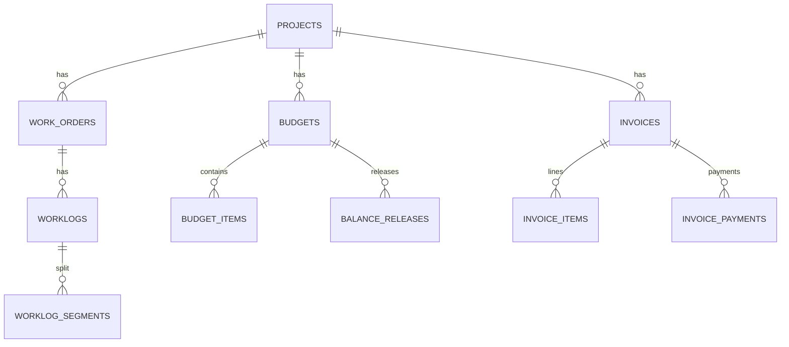

# DB Source of Truth - Finance, Approvals, Worklogs

## Scope
Critical operational and financial schema subset for handoff.

## ERD (Critical Subset)

## Table Purpose (1-liner)

- `work_orders`: order lifecycle and execution assignment.
- `worklogs`: work reporting with status and approval metadata.
- `daily_work_reports`: daily standard/non-standard reporting workflow.
- `budgets`: budget envelope and ownership context.
- `budget_items`: budget line-level planning and tracking.
- `balance_releases`: controlled budget release transactions.
- `invoices`: invoice header and payment lifecycle state.
- `invoice_items`: invoice line details and totals.
- `invoice_payments`: payment records and processing actor.

## Key Constraints (Representative)

- `work_orders.order_number` unique.
- `invoices.invoice_number` unique.
- FK coverage on core links (work, budget, payment relation keys).
- auth-critical reset model uses `otp_tokens.user_id` FK and unique hash semantics.

## Governance

- PostgreSQL is runtime source of truth.
- Schema changes only via Alembic migrations.
- Drift fixes documented and versioned.

