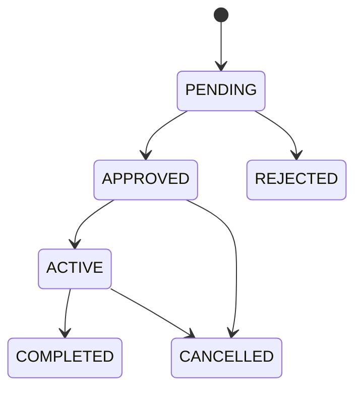
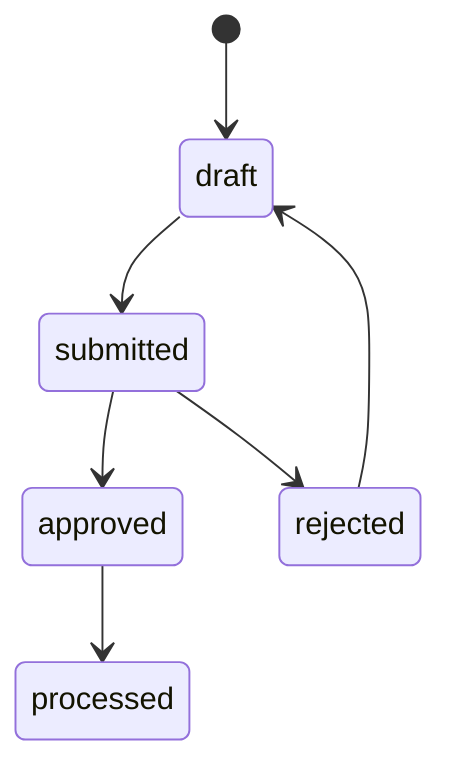
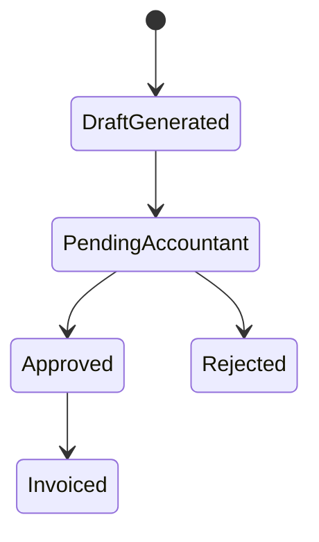
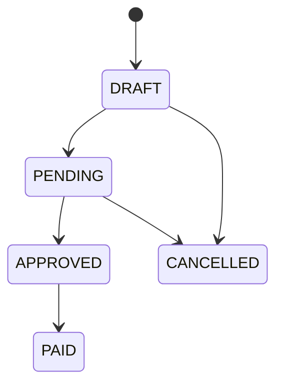

# State Machines

## Work Order

Statuses: `PENDING`, `APPROVED`, `ACTIVE`, `COMPLETED`, `REJECTED`, `CANCELLED`

## Daily Work Report

Statuses: `draft`, `submitted`, `approved`, `rejected`, `processed`

## Approval Document (Operational)

Statuses: `Draft/Generated`, `PendingAccountant`, `Approved`, `Rejected`, `Invoiced`

## Invoice

Statuses: `DRAFT`, `PENDING`, `APPROVED`, `PAID`, `CANCELLED`

