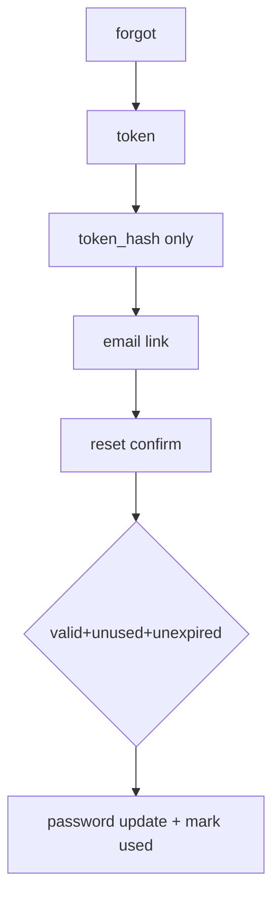
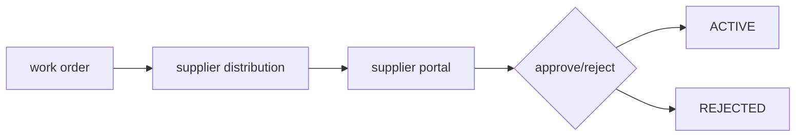
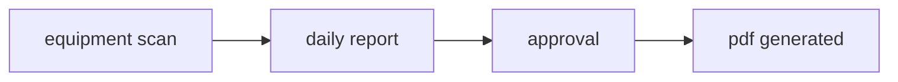
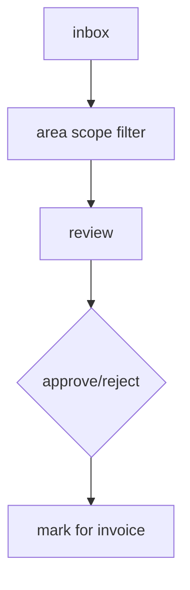
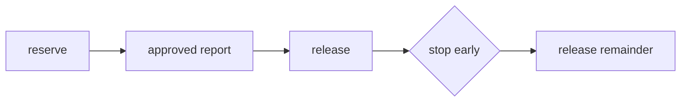

# Top 6 Mandatory Flows

## 1) Login / Remember Me / Refresh / Logout

```mermaid
flowchart TD
  A[Login] --> B[/auth/login]
  B --> C{valid}
  C -- yes --> D[access+refresh]
  D --> E{remember_me}
  E --> F[storage policy]
  F --> G[auto refresh]
  G --> H[logout]
```

- access קצר, refresh לפי policy
- בלי 401-loop
- כשל refresh מנקה auth
- logout מנקה state
- trail אירועים נשמר

## 2) Forgot Password / Reset (single-use)



- response גנרי
- hash-only
- single-use
- expiry קצר
- reuse נדחה

## 3) Work Order -> Supplier Portal -> Approve/Reject -> Active



- scope/token תקפים
- reject עם reason
- approve אטומי
- תנאי מעבר מבוקרים
- activity log חובה

## 4) Equipment Scan -> Daily Report -> Approval PDF



- scan קשור לציוד+משתמש
- תקן/לא תקן נשמר
- trail של reviewer
- PDF רק אחרי workflow תקין
- משמש ראיה תפעולית/חשבונאית

## 5) Accountant Inbox (Area-scoped) -> Approve/Reject -> Mark for Invoice



- area scope חובה
- scope גם ב-list וגם by-id
- reject עם reason
- mark for invoice רק אחרי approve
- audit actor/time

## 6) Budget Reservation -> Release per Report -> Stop Early -> Release Remainder



- reservation נועל מסגרת
- release לפי דיווחים מאושרים
- stop early משחרר יתרה
- מניעת חריגה
- תיעוד פיננסי מלא

