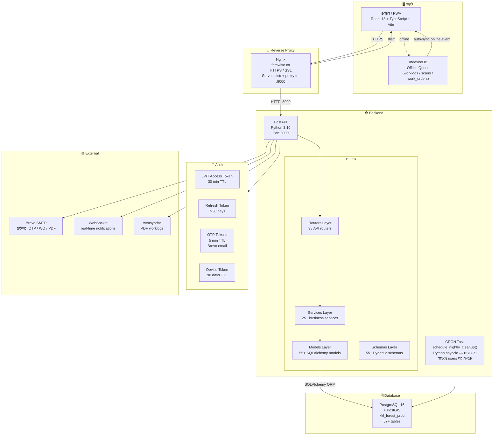
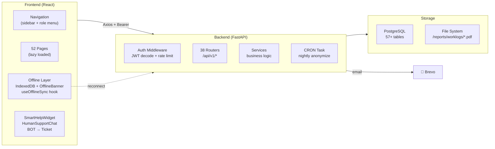
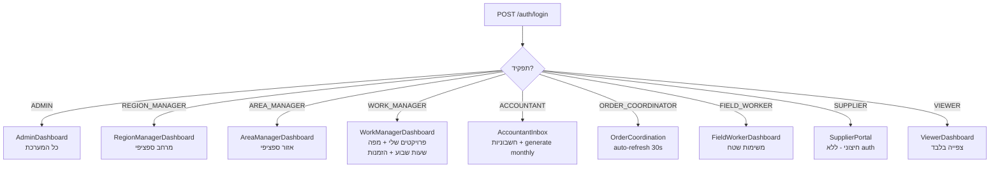

# Forewise — ארכיטקטורה כללית (עדכני מרץ 2026)

## מה המערכת עושה?
מערכת לניהול פעילות שטח ביערות קק"ל:  
פרויקטים, ציוד, ספקים, הזמנות עבודה, דיווחי שעות, חשבוניות, תקציבים.  
כולל תמיכה Offline-First לעובדי שטח + ניהול מחזור חיים של משתמשים.

---

## תרשים ארכיטקטורה עליון

---

## Tech Stack מלא

| שכבה | טכנולוגיה | גרסה | הערות |
|------|-----------|-------|--------|
| **Frontend** | React | 18 | |
| **Frontend Build** | Vite | 6 | |
| **Frontend Language** | TypeScript | 5 | |
| **Frontend Styles** | Tailwind CSS | 3 | `kkl-green: #00994C` |
| **Frontend Maps** | Leaflet | latest | PostGIS data |
| **Frontend Routing** | React Router | 6 | lazy loading |
| **Frontend Offline** | IndexedDB | native | worklog/scan/WO queue |
| **Backend** | FastAPI | latest | |
| **Backend Language** | Python | 3.10 | |
| **ORM** | SQLAlchemy | 2.0 | |
| **Migrations** | Alembic | latest | + direct SQL |
| **Validation** | Pydantic | 2 | |
| **Database** | PostgreSQL | 16 | |
| **Geo Extensions** | PostGIS | latest | SRID=4326 |
| **Reverse Proxy** | Nginx | 1.18 | |
| **Auth** | JWT + OTP + Device Token | | |
| **Email** | Brevo SMTP | | OTP + PDF |
| **PDF** | weasyprint | latest | worklog reports |
| **Task Scheduling** | asyncio (Python) | | CRON לילי |

---

## System Components Map

---

## Role-to-Dashboard Map

---

## כתובות

| שירות | URL |
|-------|-----|
| אפליקציה | https://forewise.co |
| API Docs (Swagger) | https://forewise.co/docs |
| Backend health | https://forewise.co/api/v1/health |
| Supplier Portal | https://forewise.co/supplier-portal/{token} |

---

## שרת Production

| פרמטר | ערך |
|-------|-----|
| IP | `167.99.228.10` |
| SSH User | `root` |
| Backend Service | `forewise.service` (systemctl) |
| DB | `kkl_forest_prod` @ localhost:5432 |
| DB User | `kkl_app` / `KKL_Prod_2026!` |
| Frontend | nginx serves `/root/kkl-forest/app_frontend/dist/` |
| Logs | `journalctl -u forewise -f` |
