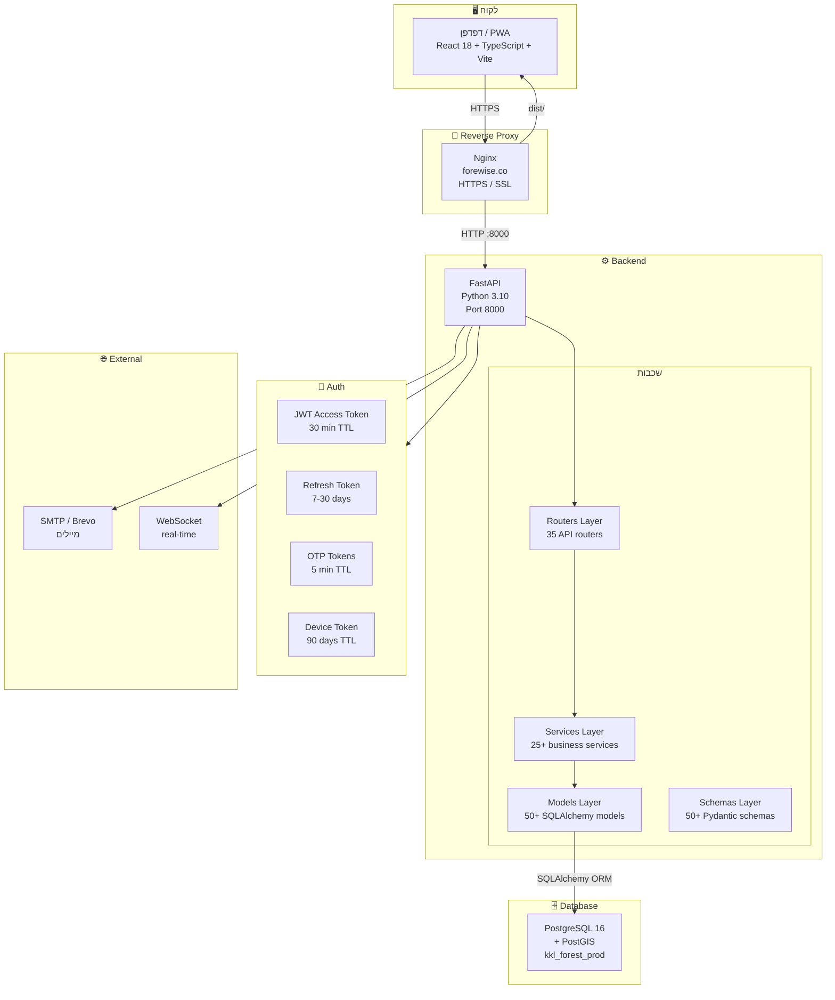

# Forewise — ארכיטקטורה כללית

## מה המערכת עושה?
מערכת לניהול פעילות שטח ביערות קק"ל: פרויקטים, ציוד, ספקים, הזמנות עבודה, דיווחי שעות, חשבוניות, תקציבים.

---

## תרשים ארכיטקטורה עליון

---

## Tech Stack מלא

| שכבה | טכנולוגיה | גרסה |
|------|-----------|-------|
| **Frontend** | React | 18 |
| **Frontend Build** | Vite | 6 |
| **Frontend Language** | TypeScript | 5 |
| **Frontend Styles** | Tailwind CSS | 3 |
| **Frontend Maps** | Leaflet | ---|
| **Frontend Routing** | React Router | 6 |
| **Backend** | FastAPI | ---|
| **Backend Language** | Python | 3.10 |
| **ORM** | SQLAlchemy | 2.0 |
| **Migrations** | Alembic | ---|
| **Validation** | Pydantic | 2 |
| **Database** | PostgreSQL | 16 |
| **Geo Extensions** | PostGIS | ---|
| **Reverse Proxy** | Nginx | 1.18 |
| **Auth** | JWT + OTP + Device Token | ---|
| **Email** | SMTP / Brevo | ---|

---

## כתובות

| שירות | URL |
|-------|-----|
| אפליקציה | https://forewise.co |
| API Docs | https://forewise.co/docs |
| Backend health | https://forewise.co/api/v1/health |
| Supplier Portal | https://forewise.co/supplier-portal/{token} |
