# Backend — כל הקבצים לפי שכבות

## תרשים שכבות Backend

```mermaid
flowchart TD
    subgraph ENTRY["נקודת כניסה"]
        MAIN["app/main.py\nFastAPI app bootstrap\nMiddleware stack\nCORS / Rate limit / Security headers"]
    end

    subgraph CORE["app/core/ — תשתית"]
        CONFIG["config.py\nSettings מ-.env\nDATABASE_URL, SECRET_KEY\nSMTP, REDIS, APP_HOST"]
        DB["database.py\nSQLAlchemy engine\nSessionLocal\nget_db dependency"]
        SECURITY["security.py\nJWT create/decode\nbcrypt password hash\ntoken TTL constants"]
        DEPS["dependencies.py\nget_current_user\nget_current_active_user\nrequire_permission"]
        EMAIL["email.py\nsend_email(to, subject, body)\nSMTP / Brevo"]
        RATE["rate_limiting.py\n100 req/min per IP\nauto-enable in prod"]
        LOGGING["logging.py\nloguru setup\nlog level from env"]
        CACHE["cache.py\nRedis client (optional)"]
        EXCEPTIONS["exceptions.py\nNotFoundException\nValidationException\nDuplicateException\nBusinessRuleError"]
    end

    subgraph ROUTERS["app/routers/ — 38 API Routers"]
        direction LR
        subgraph AUTH_R["Auth & Users"]
            R_AUTH["auth.py\n/auth/login\n/auth/register\n/auth/refresh\n/auth/logout\n/auth/request-otp\n/auth/verify-otp-v2\n/auth/device-login\n/auth/devices\n/auth/forgot-password\n/auth/reset-password\n/auth/biometric/*"]
            R_USERS["users.py\n/users CRUD\n/users/{id}/role\n/users/{id}/suspend\n/users/{id}/reactivate\n/users/search"]
            R_ROLES["roles.py\n/roles CRUD"]
            R_PERMS["permissions.py\n/permissions CRUD"]
            R_RA["role_assignments.py\n/role-assignments"]
        end
        subgraph GEO_R["Geography & Org"]
            R_REGIONS["regions.py\n/regions CRUD"]
            R_AREAS["areas.py\n/areas CRUD\n/areas/statistics"]
            R_LOCS["locations.py\n/locations CRUD"]
            R_DEPTS["departments.py\n/departments"]
            R_GEO["geo.py\n/geo/layers/all\n/geo/projects/{id}/forest-polygon"]
        end
        subgraph PROJ_R["Projects"]
            R_PROJ["projects.py\n/projects CRUD\n/projects/by-code/{code}\n/projects/code/{code}\n/projects/statistics"]
            R_PA["project_assignments.py\n/project-assignments\n/my-assignments"]
        end
        subgraph WO_R["Work Orders"]
            R_WO["work_orders.py\n/work-orders CRUD\n/work-orders/{id}/approve\n/work-orders/{id}/reject\n/work-orders/{id}/start\n/work-orders/{id}/close\n/work-orders/{id}/cancel\n/work-orders/{id}/send-to-supplier\n/work-orders/{id}/move-to-next-supplier"]
            R_WL["worklogs.py\n/worklogs CRUD\n/worklogs/approve"]
            R_SP["supplier_portal.py\n/supplier-portal/{token}\n/supplier-portal/{token}/accept\n/supplier-portal/{token}/reject"]
        end
        subgraph SUPP_R["Suppliers & Equipment"]
            R_SUPP["suppliers.py\n/suppliers CRUD\n/suppliers/{id}/equipment"]
            R_SR["supplier_rotations.py\n/supplier-rotations\nFair Rotation"]
            R_SCR["supplier_constraint_reasons.py\n/supplier-constraint-reasons"]
            R_EQ["equipment.py\n/equipment CRUD\n/equipment/{id}/scan\n/equipment/{id}/assign"]
            R_EC["equipment_categories.py"]
            R_ET["equipment_types.py"]
        end
        subgraph FIN_R["Finance"]
            R_BUDG["budgets.py\n/budgets CRUD\n/budgets/{id}/detail"]
            R_BT["budget_transfers.py\n/budget-transfers\nrequest/approve/reject"]
            R_INV["invoices.py\n/invoices CRUD\n/invoices/{id}/approve\n/invoices/generate-monthly\n/invoices/uninvoiced-suppliers"]
            R_PR["pricing.py\n/pricing/compute-cost\n/pricing/reports/by-project\n/pricing/reports/by-supplier\n/pricing/reports/by-equipment-type"]
            R_SR2["system_rates.py\n/system-rates"]
            R_ER["equipment_rates.py\n/settings/equipment-rates\n/settings/equipment-rates/{id}/history"]
        end
        subgraph MISC_R["Other"]
            R_DASH["dashboard.py\n/dashboard/statistics\n/dashboard/projects\n/dashboard/map\n/dashboard/summary"]
            R_NOTIF["notifications.py\n/notifications CRUD"]
            R_ACTLOG["activity_logs.py\n/activity-logs"]
            R_SUPP2["support_tickets.py\n/support-tickets"]
            R_REP["reports.py\n/reports"]
            R_ADMIN["admin.py\n/admin/*"]
            R_WS["websocket.py\n/ws WebSocket"]
            R_PDF["pdf_preview.py\n/pdf/preview"]
        end
    end

    subgraph SERVICES["app/services/ — Business Logic"]
        direction LR
        S_AUTH["auth_service.py\nlogin, verify_2fa\nreset_password\ngenerate_otp"]
        S_PROJ["project_service.py\nlist, create, update\nget_by_code\nsoft_delete"]
        S_WO["work_order_service.py\ncreate_work_order\nsend_to_supplier\nhandle_supplier_response\nget_work_orders"]
        S_SUPP["supplier_service.py\nlist_with_filters\nadd_supplier_equipment\nget_statistics"]
        S_EQ["equipment_service.py\nassign, release\nscan tracking"]
        S_INV["invoice_service.py\napprove, send_to_supplier\ngenerate_monthly_invoice\nget_uninvoiced_suppliers"]
        S_WL["worklog_service.py\ncreate, approve\ncalculate_worklog_totals\nsave_worklog_with_segments\nWorklogStatus: PENDING/APPROVED/REJECTED/INVOICED"]
        S_ROT["supplier_rotation_service.py\nFair Rotation algorithm\nselect_next_supplier"]
        S_BUDG["budget_service.py\nfreeze_budget_for_work_order\nrelease_budget_freeze\nrequest/approve/reject_budget_transfer"]
        S_RATE["rate_service.py\nget_rate_service(db)\nRateService.resolve_rate()\nRateService.compute_worklog_cost()\nguard: missing_rate_source"]
        S_NOTIF["notification_service.py\ncreate, mark_read"]
        S_ACT["activity_log_service.py\nlog_activity\nget_logs"]
        S_PDF["pdf_report_service.py\ngenerate_and_save_worklog_pdf\nsend PDF to supplier+accountant"]
        S_FOREST["forest_map_service.py\nPostGIS polygon ops"]
        S_LC["user_lifecycle.py (task)\nanonymize_expired_users()\nschedule_nightly_cleanup() — CRON"]
        S_OTHERS["+ more services..."]
    end

    subgraph MODELS["app/models/ — SQLAlchemy ORM Models"]
        M_USER["user.py → users table"]
        M_PROJ["project.py → projects table"]
        M_WO["work_order.py → work_orders table"]
        M_WL["worklog.py → worklogs table"]
        M_SUPP["supplier.py → suppliers table"]
        M_EQ["equipment.py → equipment table"]
        M_INV["invoice.py → invoices table"]
        M_BUDG["budget.py → budgets table"]
        M_REGION["region.py → regions table"]
        M_AREA["area.py → areas table"]
        M_OTHERS["+ 40 more models..."]
    end

    ENTRY --> CORE
    ENTRY --> ROUTERS
    ROUTERS --> SERVICES
    SERVICES --> MODELS
    CORE --> DB
    MODELS --> DB
```

---

## app/core/ — תפקיד כל קובץ

| קובץ | תפקיד |
|------|--------|
| `config.py` | כל ה-settings מ-environment variables |
| `database.py` | חיבור PostgreSQL, SessionLocal, get_db() |
| `security.py` | JWT, bcrypt, token TTL |
| `dependencies.py` | FastAPI dependencies לauth |
| `email.py` | שליחת מיילים (SMTP/Brevo) |
| `rate_limiting.py` | 100 req/min/IP |
| `logging.py` | loguru setup |
| `cache.py` | Redis client |
| `exceptions.py` | custom exceptions |

---

## app/routers/ — כל ה-38 endpoints

| Router | Prefix | Endpoints עיקריים |
|--------|--------|-------------------|
| `auth.py` | /auth | login, logout, OTP, device-login, biometric, change-password |
| `users.py` | /users | CRUD, /suspend, /reactivate, /role |
| `roles.py` | /roles | ניהול תפקידים |
| `regions.py` | /regions | מרחבים |
| `areas.py` | /areas | אזורים |
| `projects.py` | /projects | פרויקטים + workspace |
| `work_orders.py` | /work-orders | הזמנות עבודה + כל הflow |
| `worklogs.py` | /worklogs | דיווחי שעות + approve |
| `suppliers.py` | /suppliers | ספקים + ציוד ספק |
| `supplier_portal.py` | /supplier-portal | דף נחיתה לספק (ללא auth) |
| `supplier_rotations.py` | /supplier-rotations | Fair Rotation |
| `equipment.py` | /equipment | ציוד + סריקות |
| `equipment_categories.py` | /equipment-categories | קטגוריות ציוד |
| `equipment_types.py` | /equipment-types | סוגי ציוד |
| `equipment_rates.py` | /settings/equipment-rates | תעריפים + היסטוריה |
| `invoices.py` | /invoices | חשבוניות + generate-monthly |
| `budgets.py` | /budgets | תקציבים |
| `budget_transfers.py` | /budget-transfers | בקשות העברת תקציב |
| `pricing.py` | /pricing | compute-cost, reports by-project/supplier/equipment-type |
| `system_rates.py` | /system-rates | תעריפי מערכת |
| `dashboard.py` | /dashboard | נתוני לוח בקרה + work-manager-summary |
| `geo.py` | /geo | שכבות גיאוגרפיות (PostGIS) |
| `notifications.py` | /notifications | התראות |
| `reports.py` | /reports | דוחות |
| `activity_logs.py` | /activity-logs | לוג פעילות |
| `support_tickets.py` | /support-tickets | קריאות תמיכה |
| `websocket.py` | /ws | WebSocket real-time |
| `pdf_preview.py` | /pdf | תצוגה מקדימה PDF |
| `settings.py` | /settings | הגדרות מערכת |
| `admin.py` | /admin | פעולות אדמין |

---

## app/services/ — Business Logic

| Service | תפקיד |
|---------|--------|
| `auth_service.py` | login, OTP, password reset, 2FA, must_change_password |
| `project_service.py` | CRUD פרויקטים, filtering per role, auto-create budget |
| `work_order_service.py` | יצירה, שליחה לספק, flow states |
| `supplier_service.py` | רשימת ספקים, ציוד, סטטיסטיקות |
| `supplier_rotation_service.py` | Fair Rotation algorithm |
| `equipment_service.py` | הקצאת ציוד, סריקות QR |
| `invoice_service.py` | חשבוניות, אישור, **generate_monthly_invoice**, uninvoiced_suppliers |
| `worklog_service.py` | דיווחי שעות, **calculate_worklog_totals**, **save_worklog_with_segments**, 12hr limit |
| `budget_service.py` | **freeze_budget_for_work_order**, **release_budget_freeze**, budget transfers |
| `rate_service.py` | **get_rate_service(db)** — priority: supplier_equipment → equipment → equipment_type. Guard לnull equipment |
| `notification_service.py` | יצירה ושליחת התראות (WORKLOG_PENDING, INVOICE_PENDING, BUDGET_ALERT) |
| `activity_log_service.py` | לוג כל הפעולות |
| `pdf_report_service.py` | **generate_and_save_worklog_pdf** (weasyprint) + email לספק+חשבת |
| `forest_map_service.py` | PostGIS — פוליגוני יער, graceful fallback >10km |
| `region_service.py` / `area_service.py` | גיאוגרפיה ארגונית |
| `tasks/user_lifecycle.py` | **anonymize_expired_users** — CRON לילי, מאחד suspended users שפג תאריך |
