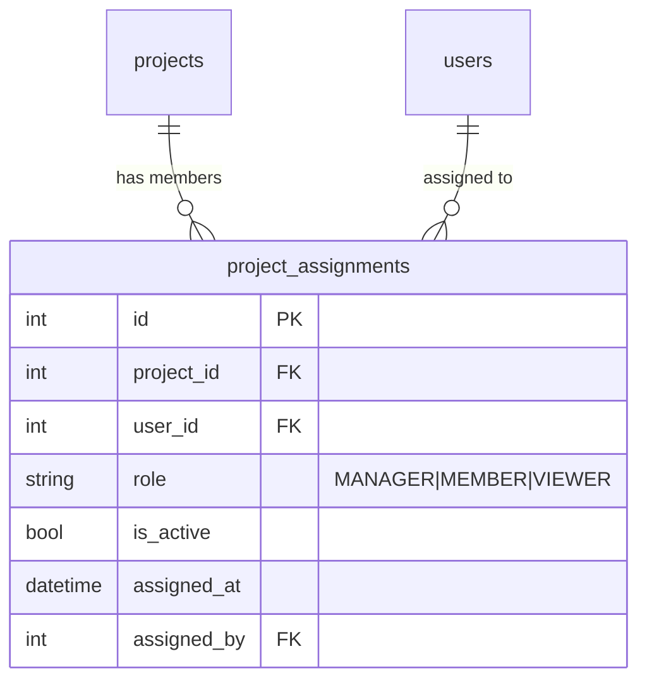

# Database — ERD מלא (PostgreSQL + PostGIS)

**Database:** `kkl_forest_prod`  
**Engine:** PostgreSQL 16 + PostGIS  
**Tables:** 57+ (עדכני מרץ 2026)  

---

## ERD ראשי — ישויות עיקריות

```mermaid
erDiagram
    users {
        int id PK
        string username UK
        string email UK
        string full_name
        string password_hash
        int role_id FK
        int region_id FK
        int area_id FK
        int department_id FK
        int manager_id FK
        bool is_active
        bool two_factor_enabled
        datetime last_login
    }

    roles {
        int id PK
        string code UK
        string name
        bool is_active
        int display_order
    }

    permissions {
        int id PK
        string code UK
        string name
        string module
        string action
    }

    role_permissions {
        int id PK
        int role_id FK
        int permission_id FK
    }

    regions {
        int id PK
        string code UK
        string name
        geometry geom "PostGIS MULTIPOLYGON"
        numeric total_budget
    }

    areas {
        int id PK
        string code UK
        string name
        int region_id FK
        geometry geom "PostGIS MULTIPOLYGON"
    }

    projects {
        int id PK
        string code UK
        string name
        text description
        int region_id FK
        int area_id FK
        int budget_id FK
        int manager_id FK
        int location_id FK
        string status
        numeric budget
        date start_date
        date end_date
        geometry location_geom "PostGIS POINT"
        bigint forest_polygon_id FK
        bool is_active
    }

    budgets {
        int id PK
        string code UK
        string name
        string budget_type
        numeric total_amount
        numeric allocated_amount
        numeric spent_amount
        numeric committed_amount
        int project_id FK
        int area_id FK
        string status
        bool is_active
    }

    work_orders {
        int id PK
        int order_number UK
        string title
        text description
        int project_id FK
        int supplier_id FK
        int equipment_id FK
        string status
        string priority
        date work_start_date
        date work_end_date
        numeric estimated_hours
        numeric hourly_rate
        numeric frozen_amount
        string portal_token UK
        datetime portal_expiry
        bool is_active
    }

    suppliers {
        int id PK
        string code UK
        string name
        string contact_name
        string phone
        string email
        int region_id FK
        int area_id FK
        numeric rating
        int total_jobs
        bool is_active
    }

    supplier_equipment {
        int id PK
        int supplier_id FK
        int equipment_model_id FK
        string license_plate
        string status
        bool is_active
    }

    equipment {
        int id PK
        string code UK
        string name
        int category_id FK
        int equipment_type_id FK
        int supplier_id FK
        string status
        bool is_active
    }

    equipment_models {
        int id PK
        string name
        int category_id FK
        bool is_active
    }

    equipment_categories {
        int id PK
        string code UK
        string name
        int parent_category_id FK
    }

    worklogs {
        int id PK
        int work_order_id FK
        int project_id FK
        int user_id FK
        int equipment_id FK
        int supplier_id FK
        string status
        date work_date
        time start_time
        time end_time
        numeric work_hours
        numeric net_hours
        numeric paid_hours
        numeric hourly_rate_snapshot
        numeric cost_before_vat
        numeric cost_with_vat
        bool is_overnight
        int overnight_nights
        numeric overnight_rate
        numeric overnight_total
        string pdf_path
        datetime pdf_generated_at
    }

    worklog_segments {
        int id PK
        int worklog_id FK
        string segment_type
        string activity_type
        time start_time
        time end_time
        numeric duration_hours
        int payment_pct
        numeric amount
        text notes
    }

    invoices {
        int id PK
        string invoice_number UK
        int supplier_id FK
        int project_id FK
        int month
        int year
        string status
        numeric total_amount
        numeric paid_amount
        date due_date
        bool is_approved
        int created_by FK
    }

    budget_transfers {
        int id PK
        int from_budget_id FK
        int to_budget_id FK
        numeric amount
        text reason
        string status
        int requested_by FK
        int approved_by FK
        text rejected_reason
        datetime requested_at
        datetime approved_at
        datetime executed_at
    }

    audit_logs {
        int id PK
        int user_id FK
        string table_name
        int record_id
        string action
        jsonb old_values
        jsonb new_values
        string ip_address
        datetime created_at
    }

    sync_queue {
        int id PK
        int user_id FK
        string type
        jsonb payload
        string ip_address
        datetime synced_at
    }

    equipment_rate_history {
        int id PK
        int equipment_type_id FK
        numeric old_rate
        numeric new_rate
        int changed_by FK
        text reason
        date effective_date
        datetime created_at
    }

    invoice_items {
        int id PK
        int invoice_id FK
        int worklog_id FK
        string description
        numeric quantity
        numeric unit_price
        numeric total_price
    }

    device_tokens {
        uuid id PK
        int user_id FK
        string token_hash UK
        uuid device_id
        string device_name
        string device_os
        bool is_active
        datetime last_used_at
        datetime expires_at
    }

    otp_tokens {
        int id PK
        int user_id FK
        string code_hash
        string purpose
        datetime expires_at
        bool is_used
        int attempts
    }

    sessions {
        int id PK
        int user_id FK
        string session_id UK
        string ip_address
        datetime expires_at
    }

    notifications {
        int id PK
        int user_id FK
        string title
        text message
        string type
        bool is_read
        datetime read_at
    }

    activity_logs {
        int id PK
        int user_id FK
        string activity_type
        string action
        string entity_type
        int entity_id
        text metadata_json
        datetime created_at
    }

    forests {
        bigint id PK
        string code UK
        string name
        geometry geom "PostGIS MULTIPOLYGON"
        numeric area_km2
    }

    forest_polygons {
        bigint id PK
        geometry geom "PostGIS MULTIPOLYGON"
        string geom_hash UK
        datetime created_at
    }

    supplier_rotations {
        int id PK
        int supplier_id FK
        int area_id FK
        int rotation_position
        int total_assignments
        int successful_completions
        int rejection_count
        datetime last_assigned_at
    }

    supplier_invitations {
        int id PK
        int work_order_id FK
        int supplier_id FK
        string status
        string portal_token
        datetime expires_at
        datetime responded_at
    }

    system_rates {
        int id PK
        string rate_type
        string equipment_category
        numeric rate_value
        bool is_active
    }

    users ||--o{ role_permissions : ""
    roles ||--o{ role_permissions : ""
    roles ||--o{ permissions : ""
    users ||--o{ sessions : ""
    users ||--o{ otp_tokens : ""
    users ||--o{ device_tokens : ""
    users ||--o{ activity_logs : ""
    users ||--o{ notifications : ""
    regions ||--o{ areas : ""
    areas ||--o{ projects : ""
    regions ||--o{ projects : ""
    projects ||--o{ work_orders : ""
    projects ||--o{ worklogs : ""
    projects ||--|| budgets : ""
    suppliers ||--o{ work_orders : ""
    suppliers ||--o{ supplier_equipment : ""
    suppliers ||--o{ supplier_rotations : ""
    equipment_models ||--o{ supplier_equipment : ""
    equipment_categories ||--o{ equipment_models : ""
    equipment ||--o{ worklogs : ""
    work_orders ||--o{ worklogs : ""
    work_orders ||--o{ supplier_invitations : ""
    invoices ||--o{ invoice_items : ""
    worklogs ||--o{ invoice_items : ""
    worklogs ||--o{ worklog_segments : ""
    budgets ||--o{ budget_transfers : "from"
    budgets ||--o{ budget_transfers : "to"
    equipment_types ||--o{ equipment_rate_history : ""
    users ||--o{ audit_logs : ""
    users ||--o{ sync_queue : ""
```



---

## טבלאות לפי קטגוריה עם ספירת שורות

### 👤 Identity & Access
| טבלה | שורות | תיאור |
|------|-------|--------|
| `users` | 8 | משתמשים אמיתיים (8 roles) |
| `roles` | 13 | תפקידים (ADMIN, WORK_MANAGER וכו') |
| `permissions` | 267 | הרשאות granular |
| `role_permissions` | 359 | מיפוי role → permissions |
| `sessions` | 405 | sessions פעילות |
| `otp_tokens` | 3 | קודי OTP ל-login |
| `device_tokens` | 1 | מכשירים trusted (biometric) |
| `role_assignments` | 0 | הקצאות role נוספות |
| `refresh_tokens` | 0 | refresh tokens |

### 🌍 Geography
| טבלה | שורות | תיאור |
|------|-------|--------|
| `regions` | 19 | מרחבים (צפון/מרכז/דרום) |
| `areas` | 21 | אזורים בתוך מרחבים |
| `locations` | 22 | נקודות מיקום פיזיות (polygon, geojson, center_lat/lng נוסף) |
| `departments` | 3 | מחלקות: הנהלה / חשבונות / מנהלי עבודה (נוקו ב-2026) |
| `forests` | 3 | יערות עם PostGIS geometry |
| `forest_polygons` | 273 | פוליגוני יער מפורטים |

### 🌲 Projects
| טבלה | שורות | תיאור |
|------|-------|--------|
| `projects` | 60 | פרויקטי יער (YR-001 עד YR-060) |
| `project_assignments` | 12 | שיוך עובדים לפרויקטים |
| `budgets` | 147 | תקציבים לפרויקטים |
| `budget_items` | 87 | פריטי תקציב |
| `budget_allocations` | 110 | הקצאות תקציביות |
| `budget_transfers` | 98 | העברות בין תקציבים |
| `balance_releases` | 144 | שחרורי יתרה |

### 🔧 Work Execution
| טבלה | שורות | תיאור |
|------|-------|--------|
| `work_orders` | 10+ | הזמנות עבודה |
| `work_order_statuses` | 72 | סטטוסים (PENDING/DISTRIBUTING וכו') |
| `worklogs` | 22+ | דיווחי שעות + is_overnight, overnight_total, pdf_path |
| `worklog_segments` | 0+ | פירוט סגמנטים (work/rest/idle/travel/overnight) |
| `worklog_statuses` | 61 | סטטוסי worklog |
| `equipment_scans` | 58 | סריקות ציוד בשטח |

### 👷 Suppliers
| טבלה | שורות | תיאור |
|------|-------|--------|
| `suppliers` | 17 | ספקים |
| `supplier_equipment` | 37 | מלאי ציוד לכל ספק |
| `supplier_rotations` | 12 | Fair Rotation state |
| `supplier_invitations` | 2 | הזמנות שנשלחו לספקים |
| `supplier_constraint_reasons` | 16 | סיבות אילוץ |
| `supplier_constraint_logs` | 0 | לוג אילוצים |
| `supplier_rejection_reasons` | 9 | סיבות דחייה |

### 🔩 Equipment
| טבלה | שורות | תיאור |
|------|-------|--------|
| `equipment` | 47 | יחידות ציוד |
| `equipment_models` | 11 | דגמי ציוד |
| `equipment_categories` | 10 | קטגוריות |
| `equipment_types` | 23 | סוגי ציוד (hourly_rate + overnight_rate נוסף) |
| `equipment_rate_history` | 0+ | **חדש** — היסטוריית שינויי תעריף |
| `equipment_maintenance` | 78 | תחזוקה |
| `equipment_assignments` | 0 | שיוכי ציוד |

### 💰 Finance
| טבלה | שורות | תיאור |
|------|-------|--------|
| `invoices` | 27 | חשבוניות |
| `invoice_items` | 2 | פריטי חשבונית |
| `invoice_payments` | 1 | תשלומים |
| `budget_transfers` | 0+ | **עדכון** — requests/approve/reject בין אזורים |
| `system_rates` | 6 | תעריפי מערכת |
| `sync_queue` | 0+ | **חדש** — audit ל-offline sync (X-Offline-Sync header) |

### 📊 Reporting & Ops
| טבלה | שורות | תיאור |
|------|-------|--------|
| `activity_logs` | 731+ | לוג פעילות מלא |
| `activity_types` | 245 | סוגי פעילויות |
| `notifications` | 0 | התראות (נוקו — נמחקו כל הישנות לפני 2026-03-01) |
| `audit_logs` | 0+ | **חדש** — שינוי סטטוס, SUSPEND, ROLE CHANGE |
| `reports` | 12 | דוחות שמורים |
| `report_runs` | 0 | הרצות דוחות |
| `support_tickets` | 12 | כרטיסי תמיכה |
| `support_ticket_comments` | 4 | תגובות |

---

## שינויי Schema — מרץ 2026

### `users` — עמודות חדשות
```sql
ALTER TABLE users ADD COLUMN suspended_at          TIMESTAMP NULL;
ALTER TABLE users ADD COLUMN suspension_reason      TEXT NULL;
ALTER TABLE users ADD COLUMN scheduled_deletion_at  TIMESTAMP NULL;
ALTER TABLE users ADD COLUMN previous_role_id       INTEGER NULL REFERENCES roles(id);
-- status נורמל: ערכים = 'active' | 'suspended' | 'deleted'
```

### `worklogs` — עמודות חדשות
```sql
ALTER TABLE worklogs ADD COLUMN is_overnight      BOOLEAN DEFAULT FALSE;
ALTER TABLE worklogs ADD COLUMN overnight_nights  INTEGER DEFAULT 0;
ALTER TABLE worklogs ADD COLUMN overnight_rate    NUMERIC(10,2) DEFAULT 0;
ALTER TABLE worklogs ADD COLUMN overnight_total   NUMERIC(10,2) DEFAULT 0;
ALTER TABLE worklogs ADD COLUMN net_hours         NUMERIC(5,2) DEFAULT 0;
ALTER TABLE worklogs ADD COLUMN paid_hours        NUMERIC(5,2) DEFAULT 0;
ALTER TABLE worklogs ADD COLUMN pdf_path          VARCHAR(500) NULL;
ALTER TABLE worklogs ADD COLUMN pdf_generated_at  TIMESTAMP NULL;
```

### `worklog_segments` — טבלה חדשה
```sql
CREATE TABLE worklog_segments (
    id              SERIAL PRIMARY KEY,
    worklog_id      INTEGER NOT NULL REFERENCES worklogs(id) ON DELETE CASCADE,
    segment_type    VARCHAR(50) NOT NULL, -- 'work'|'rest'|'idle'|'travel'|'overnight'
    activity_type   VARCHAR(50),
    start_time      TIME NOT NULL,
    end_time        TIME NOT NULL,
    duration_hours  NUMERIC(5,2),
    payment_pct     INTEGER DEFAULT 100,
    amount          NUMERIC(10,2) DEFAULT 0,
    notes           TEXT,
    created_at      TIMESTAMP DEFAULT NOW()
);
```

### `equipment_types` — עמודות חדשות
```sql
ALTER TABLE equipment_types ADD COLUMN hourly_rate    NUMERIC(10,2) DEFAULT 0;
ALTER TABLE equipment_types ADD COLUMN overnight_rate NUMERIC(10,2) DEFAULT 0;
-- default_hourly_rate = עמודה ישנה = 100 (placeholder)
-- hourly_rate = עמודה חדשה, 0 ברירת מחדל
```

### `equipment_rate_history` — טבלה חדשה
```sql
CREATE TABLE IF NOT EXISTS equipment_rate_history (
    id                  SERIAL PRIMARY KEY,
    equipment_type_id   INTEGER REFERENCES equipment_types(id),
    old_rate            NUMERIC(10,2),
    new_rate            NUMERIC(10,2),
    changed_by          INTEGER REFERENCES users(id),
    reason              TEXT,
    effective_date      DATE DEFAULT CURRENT_DATE,
    created_at          TIMESTAMP DEFAULT NOW()
);
```

### `locations` — עמודות חדשות
```sql
ALTER TABLE locations ADD COLUMN IF NOT EXISTS polygon    JSONB;
ALTER TABLE locations ADD COLUMN IF NOT EXISTS geojson    JSONB;
ALTER TABLE locations ADD COLUMN IF NOT EXISTS center_lat FLOAT;
ALTER TABLE locations ADD COLUMN IF NOT EXISTS center_lng FLOAT;
```

### `audit_logs` — טבלה חדשה
```sql
CREATE TABLE IF NOT EXISTS audit_logs (
    id          SERIAL PRIMARY KEY,
    user_id     INTEGER REFERENCES users(id) ON DELETE SET NULL,
    table_name  VARCHAR(100) NOT NULL,
    record_id   INTEGER,
    action      VARCHAR(50) NOT NULL,
    old_values  JSONB,
    new_values  JSONB,
    ip_address  VARCHAR(45),
    created_at  TIMESTAMP DEFAULT NOW()
);
```

### `budget_transfers` — עמודה חדשה (מרץ 2026)
```sql
ALTER TABLE budget_transfers ADD COLUMN IF NOT EXISTS rejected_reason TEXT NULL;
-- נוסף לתמיכה ב-reject endpoint עם סיבת דחייה
```

### `project_assignments` — מבנה (מרץ 2026)
```sql
-- שיוך WORK_MANAGERs לפרויקטים
-- בשימוש ב: GET /projects/code/{code} → manager field
SELECT u.id, u.full_name
FROM project_assignments pa
JOIN users u ON u.id = pa.user_id
JOIN roles r ON r.id = u.role_id
WHERE pa.project_id = :pid
  AND pa.is_active = TRUE
  AND r.code = 'WORK_MANAGER'
LIMIT 1;

-- columns: id, project_id, user_id, role ('MANAGER'|'MEMBER'|'VIEWER'),
--          is_active, assigned_at, assigned_by
```

### ERD — project_assignments relationships

