# Frontend — כל הקבצים לפי שכבות

## מבנה תיקיות Frontend

```
app_frontend/src/
├── main.tsx                    ← Bootstrap App + PWA service worker
├── App.tsx                     ← Shell: Navigation + routing + auth state
├── index.css                   ← Global styles (Tailwind)
│
├── routes/
│   └── index.tsx               ← כל ה-routes עם lazy loading + ProtectedRoute
│
├── pages/                      ← 20 תיקיות, 53+ קבצי tsx
├── components/                 ← רכיבים משותפים
├── contexts/                   ← React contexts
├── services/                   ← API calls
├── hooks/                      ← Custom hooks
├── utils/                      ← Utilities
├── types/                      ← TypeScript types
└── config/                     ← Configuration
```

---

## תרשים Frontend Architecture

```mermaid
flowchart TB
    subgraph ENTRY["Entry Point"]
        MAIN["main.tsx\nReactDOM.createRoot\nBrowserRouter\nAuthProvider\nPWA SW registration"]
        APP["App.tsx\nNavigation render\nRoute guards\nisLoggedIn state\nGlobal loading"]
    end

    subgraph ROUTING["Routes (routes/index.tsx)"]
        PUBLIC["Public Routes\n/login\n/otp\n/forgot-password\n/reset-password\n/supplier-portal/:token"]
        GUARDED["Protected Routes\n(ProtectedRoute + permission check)"]
    end

    subgraph PAGES["Pages (53 files)"]
        direction LR
        subgraph AUTH_P["Auth"]
            LOGIN["Login/Login.tsx\nForm + OTP flow\nRemember Me\nBiometric UI"]
            OTP["OTP/OTP.tsx\n6-digit code verify"]
            FORGOT["Login/ForgotPassword.tsx"]
            RESET["Login/ResetPassword.tsx"]
        end
        subgraph DASH_P["Dashboard (9 variants)"]
            DASH["Dashboard/Dashboard.tsx\nRouter per role"]
            ADMIN_D["AdminDashboard.tsx"]
            REGION_D["RegionManagerDashboard.tsx"]
            AREA_D["AreaManagerDashboard.tsx"]
            WORK_D["WorkManagerDashboard.tsx"]
            ACCT_D["AccountantDashboard.tsx"]
            COORD_D["OrderCoordinatorDashboard.tsx"]
            FIELD_D["FieldWorkerDashboard.tsx"]
            SUPP_D["SupplierManagerDashboard.tsx"]
            VIEW_D["ViewerDashboard.tsx"]
        end
        subgraph GEO_P["Geography"]
            REGIONS["Regions/Regions.tsx\nרשימת מרחבים"]
            REG_DET["Regions/RegionDetail.tsx"]
            NEW_REG["Regions/NewRegion.tsx"]
            EDIT_REG["Regions/EditRegion.tsx"]
            AREAS["Areas/Areas.tsx"]
            AREA_DET["Areas/AreaDetail.tsx"]
            NEW_AREA["Areas/NewArea.tsx"]
            LOCS["Locations/LocationsClean.tsx"]
        end
        subgraph PROJ_P["Projects"]
            PROJS["Projects/ProjectsClean.tsx\nרשימת פרויקטים"]
            PROJ_WS["Projects/ProjectWorkspaceNew.tsx\nWorkspace + Tabs\n(הזמנות/WorLog/מפה/תקציב)"]
            NEW_P["Projects/NewProject.tsx"]
            EDIT_P["Projects/EditProject.tsx"]
        end
        subgraph WO_P["Work Orders"]
            WOS["WorkOrders/WorkOrders.tsx\nרשימת הזמנות"]
            WO_DET["WorkOrders/WorkOrderDetail.tsx\napprove/reject/start/complete"]
            NEW_WO["WorkOrders/NewWorkOrder.tsx"]
            EDIT_WO["WorkOrders/EditWorkOrder.tsx"]
            COORD["WorkOrders/OrderCoordination.tsx\nשליחה לספק\nניהול סבב"]
        end
        subgraph WL_P["WorkLogs"]
            WLS["WorkLogs/WorkLogs.tsx"]
            WL_NEW["WorkLogs/WorklogCreateNew.tsx"]
            WL_DET["WorkLogs/WorklogDetail.tsx"]
            WL_APP["WorkLogs/WorklogApproval.tsx"]
        end
        subgraph SUPP_P["Suppliers"]
            SUPPS["Suppliers/Suppliers.tsx"]
            NEW_S["Suppliers/NewSupplier.tsx"]
            EDIT_S["Suppliers/EditSupplier.tsx\nTabbed: פרטים + כלים"]
            ADD_EQ["Suppliers/AddSupplierEquipment.tsx"]
            PORTAL["SupplierPortal/SupplierPortal.tsx\nחיצוני - ללא auth\nקבלה/דחייה הזמנה"]
        end
        subgraph EQ_P["Equipment"]
            EQ_INV["Equipment/EquipmentInventory.tsx"]
            EQ_DET["Equipment/EquipmentDetail.tsx"]
            EQ_SCAN["Equipment/EquipmentScan.tsx\nQR Scanner"]
            EQ_BAL["Equipment/EquipmentBalances.tsx"]
            EQ_REQ["Equipment/EquipmentRequestsStatus.tsx"]
        end
        subgraph FIN_P["Finance"]
            INVS["Invoices/Invoices.tsx"]
            BUDGS["Settings/Budgets.tsx"]
            BUDG_DET["Settings/BudgetDetail.tsx"]
        end
        subgraph MAP_P["Map"]
            MAP["Map/ForestMap.tsx\nLeaflet\nRegions/Areas/Projects\nGeo validation NEAR/FAR"]
        end
        subgraph SETTINGS_P["Settings"]
            SYS_SET["Settings/SystemSettings.tsx"]
            ROLES_P["Settings/RolesPermissions.tsx"]
            FAIR_R["Settings/FairRotation.tsx"]
            CONSTR["Settings/ConstraintReasons.tsx"]
            EQ_CAT["Settings/EquipmentCatalog.tsx\n2 tabs: כרטיסים + תעריפים\nbadge תעריף על כרטיס"]
            WH["Settings/WorkHours.tsx"]
            SUPP_SET["Settings/SupplierSettings.tsx"]
        end
        subgraph OTHER_P["Other"]
            USERS_P["Users/Users.tsx\nbadge מושהה/נמחק\nSuspendModal + ChangeRoleModal"]
            NEW_U["Users/NewUser.tsx"]
            EDIT_U["Users/EditUser.tsx"]
            NOTIFS["Notifications/Notifications.tsx"]
            ACTS["ActivityLog/ActivityLogNew.tsx"]
            SUPPORT["Support/Support.tsx\nWhatsApp style + הגב + סגור"]
            REPORTS["Reports/PricingReports.tsx\nbadge unverified_count\nבאנר missing_rate_source"]
            BUDG_TRANS["Budget/BudgetTransfers.tsx\nROLE: AREA_MANAGER + REGION_MANAGER"]
            PEND_SYNC["PendingSync/PendingSync.tsx\nממתינים לסנכרון"]
            CH_PASS["Login/ChangePassword.tsx\nמסך שינוי סיסמה חובה"]
        end
    end

    subgraph COMPONENTS["Components"]
        direction LR
        subgraph NAV_C["Navigation"]
            NAV["Navigation/Navigation.tsx\nSidebar + Role menu\nHamburger mobile"]
        end
        subgraph MAP_C["Map"]
            LEAFLET["Map/LeafletMap.tsx\nLeaflet wrapper\npoints/polygons/mask"]
            PROJMAP["Map/ProjectMap.tsx"]
        end
        subgraph COMMON_C["Common UI"]
            PROT["common/ProtectedRoute.tsx\nAuth + permission check\nlocalStorage+sessionStorage"]
            TOAST["common/Toast.tsx\nGlobal toast system"]
            MODAL["common/Modal.tsx"]
            BTN["common/Button.tsx"]
            INP["common/Input.tsx"]
            SEL["common/Select.tsx"]
            BADGE["common/Badge.tsx"]
            LOADER["common/UnifiedLoader.tsx\nTreeLoader\nPageLoader"]
            DATE_P["common/DatePicker.tsx"]
            TABS["common/Tabs.tsx"]
            SKEL["common/Skeleton.tsx"]
            EMPTY["common/EmptyState.tsx"]
            OFFLINE_BNR["OfflineBanner.tsx\nפס כתום כשאין חיבור"]
        end
        subgraph EQ_C["Equipment Components"]
            QR["equipment/QRScanner.tsx\ncamera-based scan"]
            ATTACH["equipment/AttachEquipmentModal.tsx"]
        end
        subgraph HELP_C["Help & Chat"]
            CHAT["HelpWidget/HumanSupportChat.tsx"]
            SMART["HelpWidget/SmartHelpWidget.tsx"]
        end
        CAL["Calendar/ModernCalendar.tsx"]
        WLF["WorkLogForm.tsx"]
        PROJ_CARD["ProjectCard.tsx"]
        EQ_CARD["EquipmentCard.tsx"]
        DEBUG["DebugPanel.tsx"]
    end

    subgraph CONTEXTS["Contexts"]
        AUTH_CTX["contexts/AuthContext.tsx\nuser state\nlogin/logout\nisAuthenticated\nloadUserFromStorage"]
        LOAD_CTX["contexts/LoadingContext.tsx\nglobalLoading state"]
        NOTIF_CTX["contexts/NotificationContext.tsx"]
    end

    subgraph SERVICES["Services (API calls)"]
        API_S["services/api.ts\nAxios instance\nbaseURL=forewise.co/api/v1\nAuth interceptor\nRefresh token logic"]
        AUTH_SVC["services/authService.ts\nisAuthenticated()\ngetCurrentUser()\nlogout()"]
        PROJ_SVC["services/projectService.ts"]
        WO_SVC["services/workOrderService.ts\ngetWorkOrders\napproveWorkOrder\nrejectWorkOrder\nstartWorkOrder"]
        SUPP_SVC["services/supplierService.ts"]
        EQ_SVC["services/equipmentService.ts"]
        WL_SVC["services/workLogService.ts"]
        BUDG_SVC["services/budgetService.ts"]
        INV_SVC["services/invoiceService.ts"]
        NOTIF_SVC["services/notificationService.ts"]
        REGION_SVC["services/regionService.ts"]
        AREA_SVC["services/areaService.ts"]
        LOC_SVC["services/locationService.ts"]
        REPORT_SVC["services/reportService.ts"]
        DASH_SVC["services/dashboardService.ts"]
        BIO_SVC["services/biometricService.ts\nWebAuthn API calls"]
        OTP_SVC["services/otpService.ts"]
    end

    subgraph UTILS["Utils & Hooks"]
        AUTH_STOR["utils/authStorage.ts\nsetAuthSession\nreadUserFromStorage\nclearAuthSession\nlocalStorage+sessionStorage"]
        PERMS_U["utils/permissions.ts\ngetUserRole()\ngetUserPermissions()\nhasPermission()\nUSER_ROLE enum"]
        DATE_U["utils/date.ts"]
        FORMAT_U["utils/format.ts"]
        DEBUG_U["utils/debug.ts\ndebugLogger"]
        ICONS_U["utils/icons.ts"]
        STATUS_U["utils/statusTranslation.ts"]
        USE_API["hooks/useApi.ts"]
        USE_MOBILE["hooks/useIsMobile.ts"]
        USE_OFFLINE["hooks/useOfflineSync.ts\nauto-sync on reconnect\nIndexedDB queue"]
        USE_WS["hooks/useWebSocket.ts\nWebSocket client"]
        USE_AUTH["hooks/useAuth.ts"]
        MENU_CFG["config/menuConfig.ts\nתפריט לפי role"]
    end

    MAIN --> APP
    APP --> ROUTING
    ROUTING --> PAGES
    PAGES --> COMPONENTS
    PAGES --> SERVICES
    SERVICES --> API_S
    APP --> CONTEXTS
    COMPONENTS --> CONTEXTS
    UTILS --> CONTEXTS
```



---

## pages/ — תיאור מלא של כל דף

---

## שינויים בקבצי Pages — מרץ 2026

### נמחקו
| קובץ | סיבה |
|------|-------|
| `Suppliers/UpdateSupplierEquipmentRate.tsx` | Dead link — אין route פעיל אליו |
| `components/common/StatusBadge.tsx` | קובץ ריק לחלוטין |
| `Settings/EquipmentRates.tsx` | מוזג לתוך `EquipmentCatalog.tsx` (tab "תעריפים") |

### נוספו
| קובץ | נתיב | תיאור |
|------|------|--------|
| `Login/ChangePassword.tsx` | `/change-password` | שינוי סיסמה חובה בכניסה ראשונה |
| `Budget/BudgetTransfers.tsx` | `/budget-transfers` | בקשות העברת תקציב בין אזורים |
| `PendingSync/PendingSync.tsx` | `/pending-sync` | רשימת פריטים ממתינים לסנכרון offline |

---

### Auth Pages
| דף | נתיב | תיאור |
|----|------|--------|
| Login | `/login` | טופס login, remember me, biometric button |
| OTP | `/otp` | קוד 6 ספרות, countdown, redirect לChangePassword אם must_change_password |
| ForgotPassword | `/forgot-password` | שליחת מייל reset |
| ResetPassword | `/reset-password` | קביעת סיסמה חדשה עם token |
| ChangePassword | `/change-password` | **חדש** — שינוי סיסמה חובה בכניסה ראשונה |

### Dashboard (9 variants)
| דף | תפקיד | מה מציג |
|----|--------|---------|
| Dashboard | ← router per role | מעביר לדשבורד הנכון |
| AdminDashboard | ADMIN | כל המערכת |
| RegionManagerDashboard | REGION_MANAGER | מרחב ספציפי |
| AreaManagerDashboard | AREA_MANAGER | אזור ספציפי |
| WorkManagerDashboard | WORK_MANAGER | הזמנות שלי |
| AccountantDashboard | ACCOUNTANT | חשבוניות ותקציבים |
| OrderCoordinatorDashboard | ORDER_COORDINATOR | תיאום הזמנות |
| FieldWorkerDashboard | FIELD_WORKER | משימות שטח |
| SupplierManagerDashboard | SUPPLIER | הזמנות לספק |
| ViewerDashboard | VIEWER | צפייה בלבד |

### Project Workspace
הדף המרכזי ביותר — `ProjectWorkspaceNew.tsx`:
- Tab: **סקירה** — פרטי פרויקט, תקציב, מנהל
- Tab: **הזמנות עבודה** — כל ה-WOs של הפרויקט
- Tab: **דיווחי שעות** — worklogs
- Tab: **מפה** — ForestMap עם Leaflet
- Tab: **ציוד** — ציוד משויך לפרויקט

---

## services/ — API Service Layer

| Service | API calls עיקריות |
|---------|------------------|
| `api.ts` | Axios base + auth interceptor + refresh |
| `authService.ts` | isAuthenticated, getCurrentUser, logout |
| `workOrderService.ts` | getWorkOrders, approve, reject, start, complete |
| `supplierService.ts` | getSuppliers, getSupplierEquipment |
| `projectService.ts` | getProjects, getProjectByCode |
| `equipmentService.ts` | getEquipment, assignEquipment |
| `workLogService.ts` | getWorklogs, createWorklog |
| `budgetService.ts` | getBudgets, createBudget |
| `biometricService.ts` | WebAuthn register/authenticate |

---

## utils/ — כלים

| קובץ | תפקיד |
|------|--------|
| `authStorage.ts` | **Critical** — ניהול tokens בlocalStorage+sessionStorage |
| `permissions.ts` | בדיקת הרשאות בפרונטאנד, getUserRole/Permissions |
| `date.ts` | פורמט תאריכים |
| `format.ts` | פורמט מספרים ומטבע |
| `debug.ts` | debugLogger לפיתוח |
| `statusTranslation.ts` | תרגום סטטוסים לעברית |

---

## contexts/ — State Management

| Context | מה מנהל |
|---------|---------|
| `AuthContext` | user state, isAuthenticated, login/logout, loadUserFromStorage |
| `LoadingContext` | globalLoading flag |
| `NotificationContext` | real-time notifications |
