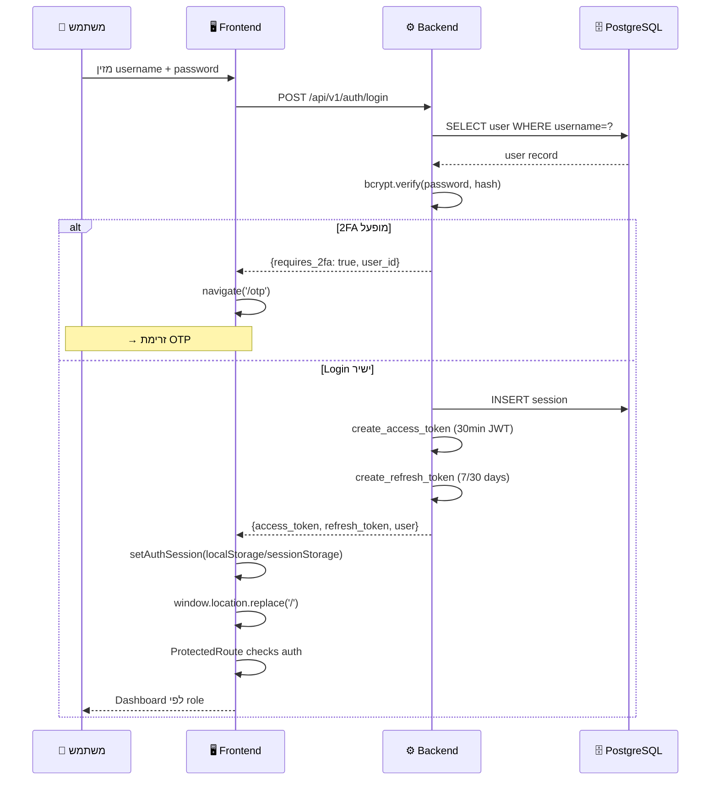
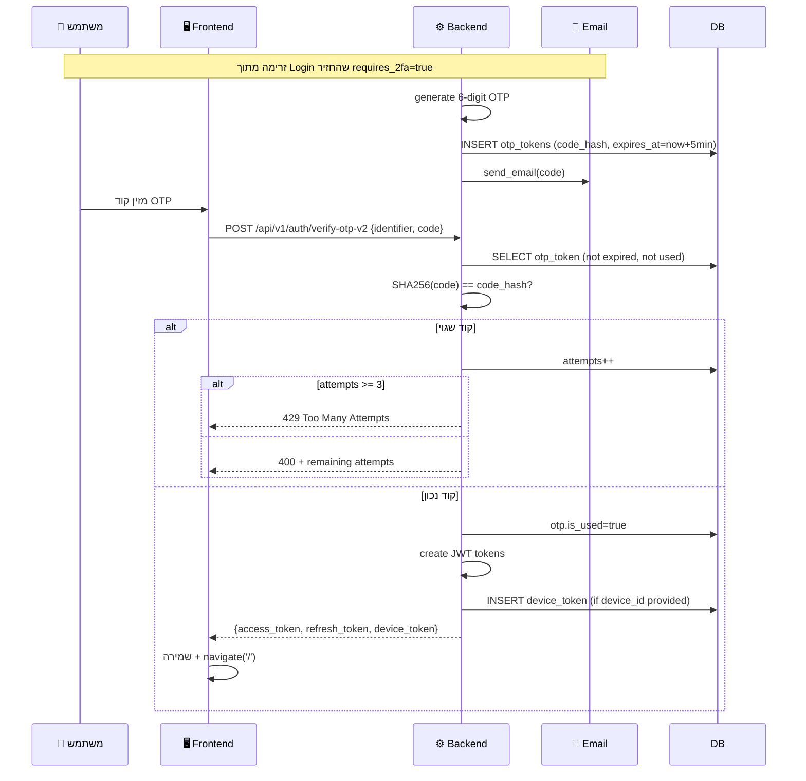
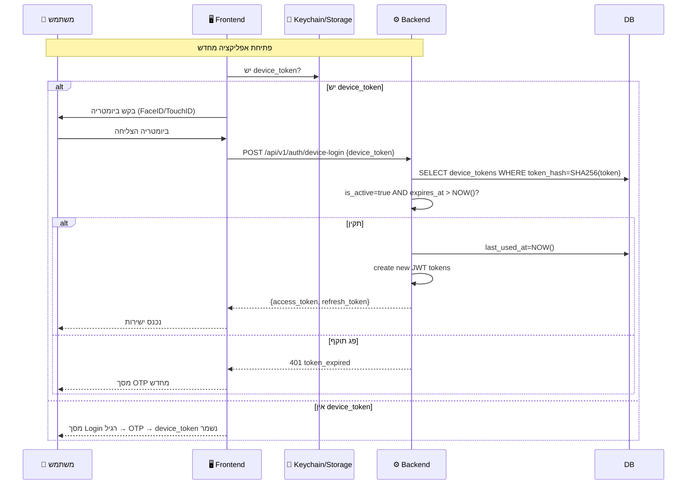
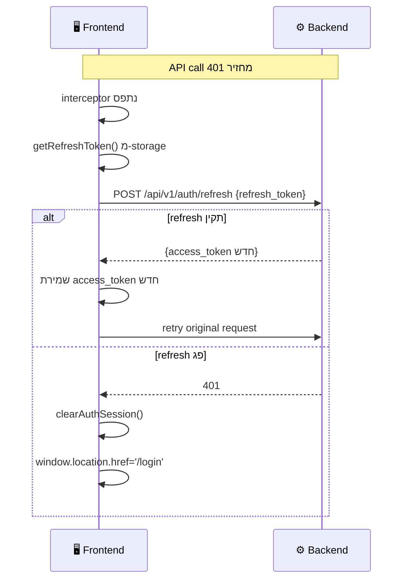
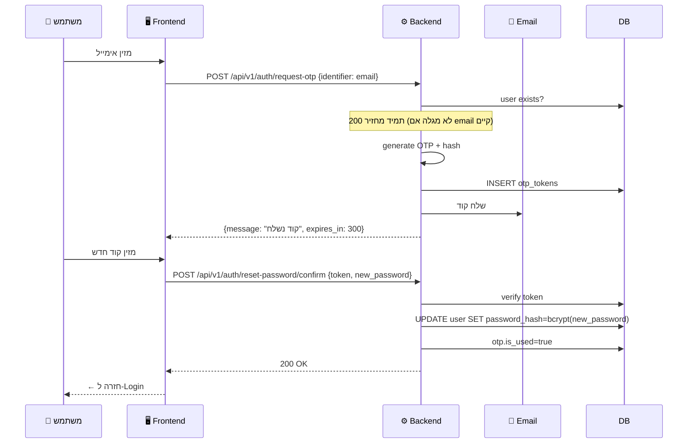
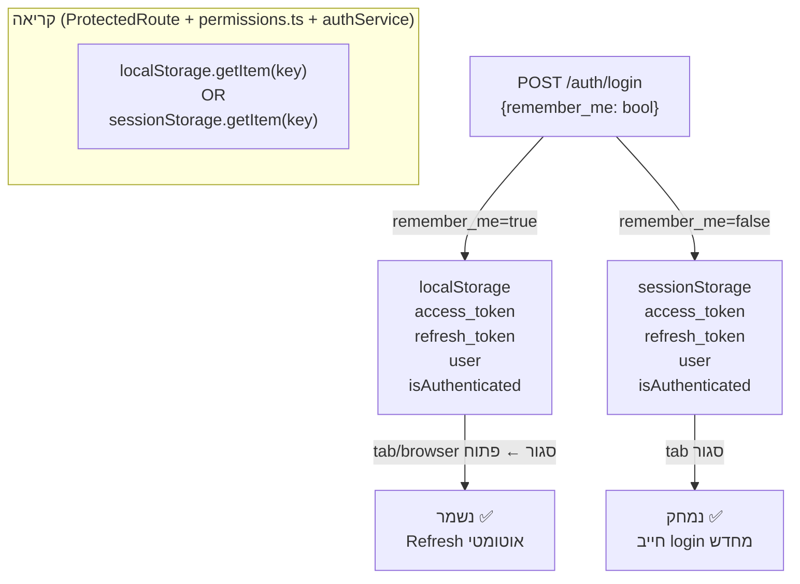
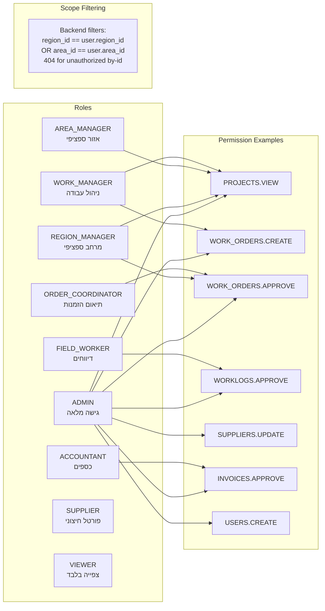

# Auth Flows — כל זרימות האימות

## 1. Login רגיל (Username + Password)

---

## 2. OTP / 2FA Flow

---

## 3. Device Token / Biometric Flow

---

## 4. Auto Refresh Token

---

## 5. Forgot Password Flow

---

## 6. Remember Me — Storage Policy

---

## 7. RBAC — Roles & Permissions

