# Business Flows — זרימות עסקיות

## 1. Work Order Flow מקצה לקצה

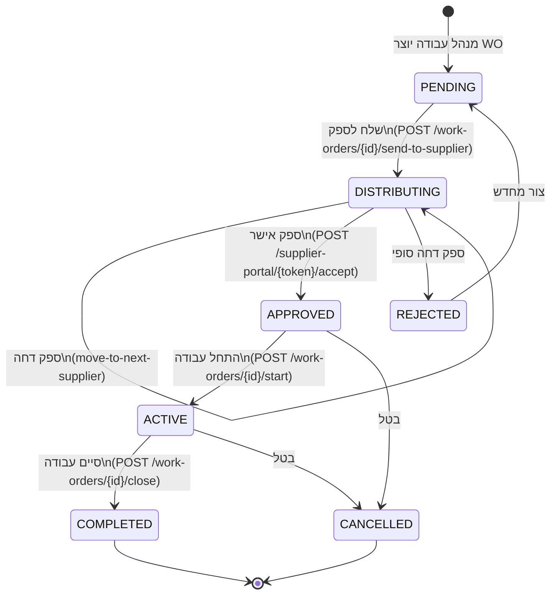

---

## 2. Work Order — Sequence מלא

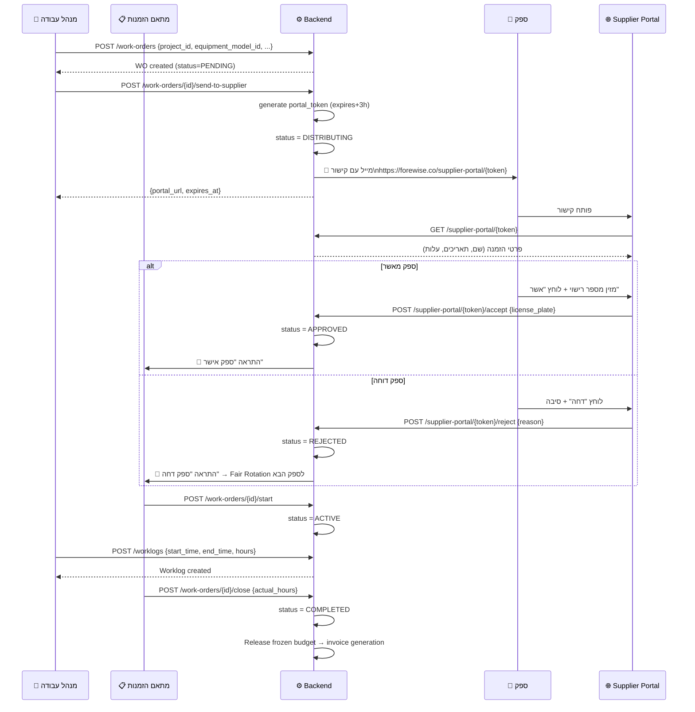

---

## 3. Fair Rotation Algorithm

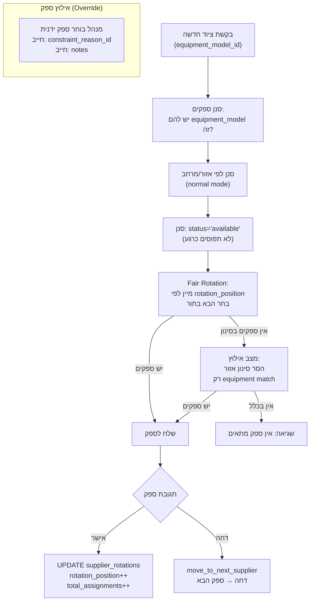

---

## 4. Worklog → Invoice Flow

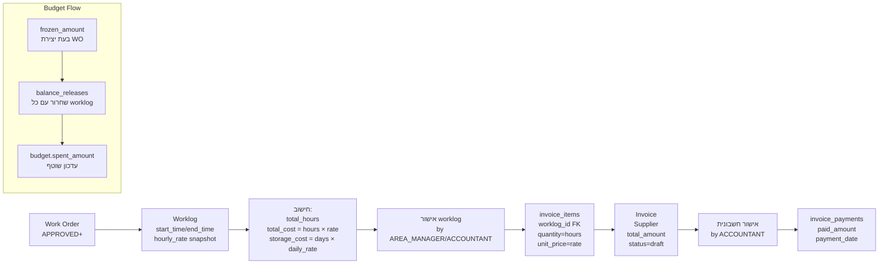

---

## 5. Project Hierarchy

```mermaid
flowchart TD
    ORG["קק\"ל\n(הארגון)"]
    ORG --> REGION1["מרחב צפון\n23 פרויקטים\n₪188.7M תקציב"]
    ORG --> REGION2["מרחב מרכז\n20 פרויקטים\n₪31.1M תקציב"]
    ORG --> REGION3["מרחב דרום\n16 פרויקטים\n₪27.7M תקציב"]

    REGION1 --> AREA1["גליל עליון\n7 פרויקטים"]
    REGION1 --> AREA2["גליל מערבי+כרמל\n6 פרויקטים"]
    REGION1 --> AREA3["גליל תחתון+גלבוע\n6 פרויקטים"]
    REGION1 --> AREA4["עמק החולה\n4 פרויקטים"]

    AREA1 --> PROJ1["יער בירייה (YR-001)\n₪728K תקציב\n10 WOs"]
    AREA1 --> PROJ2["יער מתת (YR-002)"]
    AREA1 --> PROJ3["..."]

    subgraph PROJ_DATA["לכל פרויקט"]
        WO_LIST["Work Orders"]
        WL_LIST["Worklogs"]
        BUDGET["Budget"]
        EQUIP["Equipment"]
        MAP_P["Location (PostGIS Point)"]
        FOREST["Forest Polygon (PostGIS)"]
    end
```

---

## 6. Supplier Portal Flow

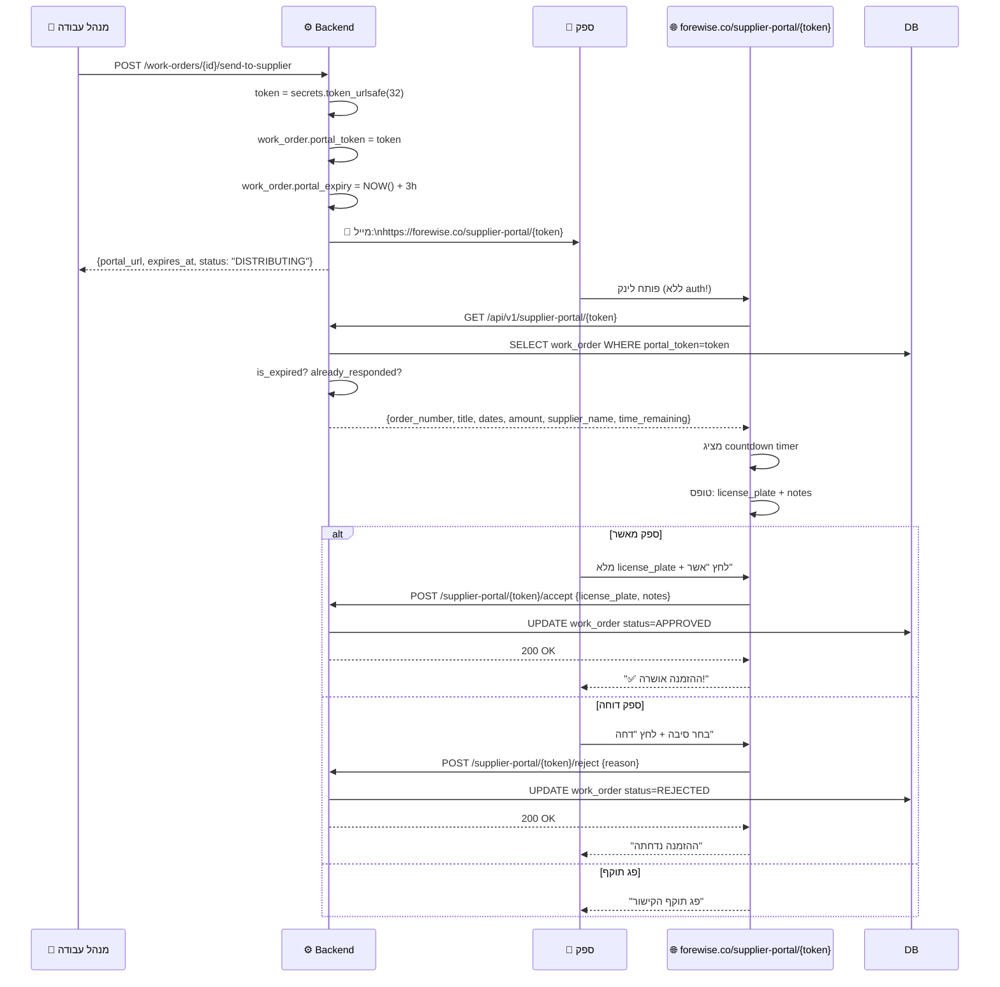

---

## 7. Equipment QR Scan Flow

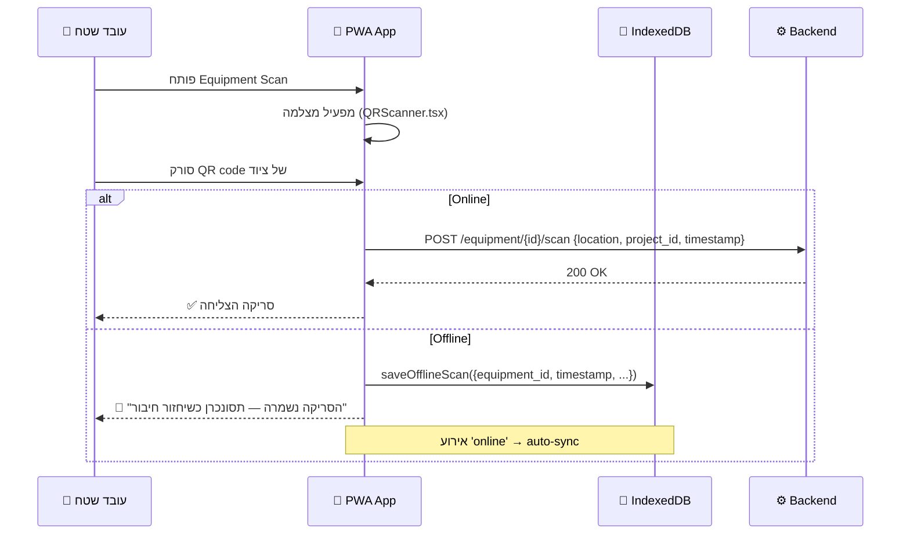

---

## 8. Offline-First Sync Flow

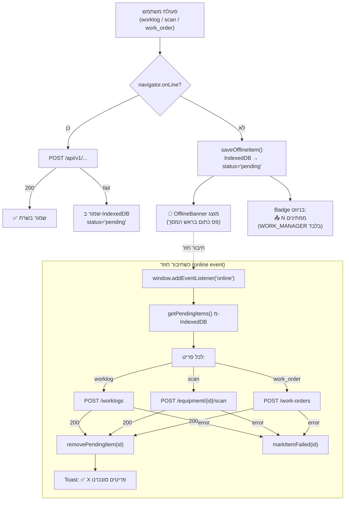

---

## 9. Budget Freeze & Release Flow

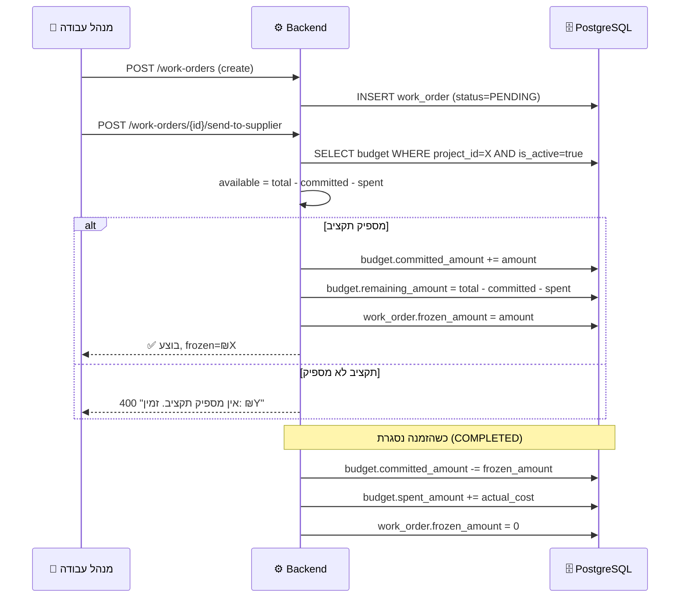

---

## 10. Budget Transfer Flow

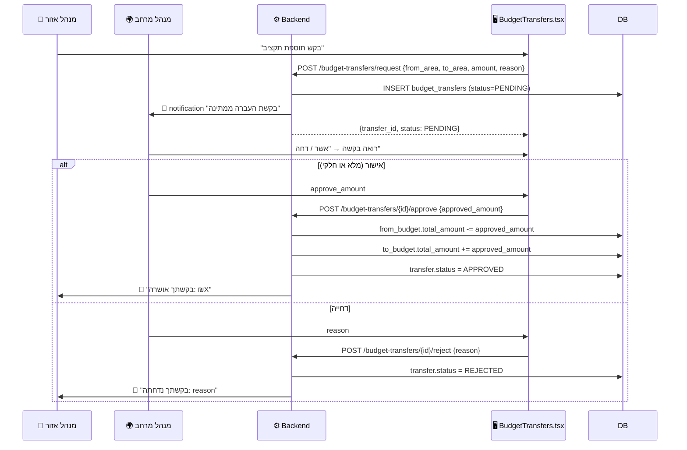

---

## 11. Monthly Invoice Generation Flow

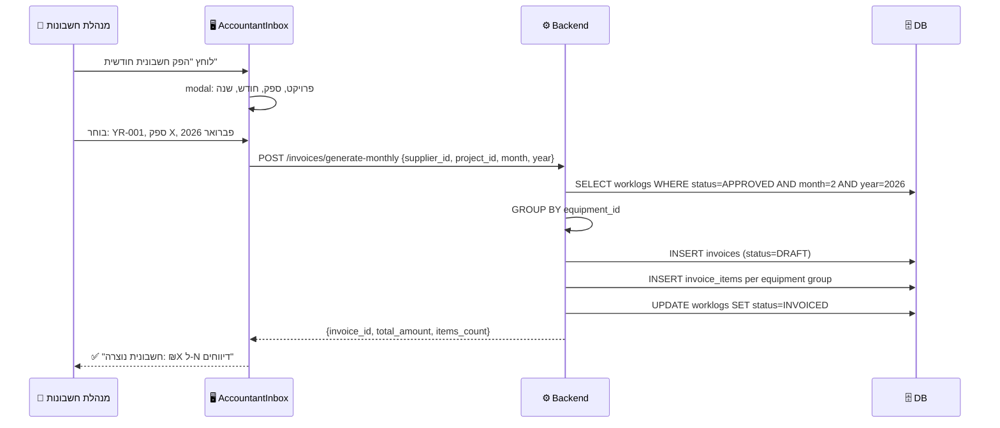

---

## 12. Worklog Rate Resolution Flow

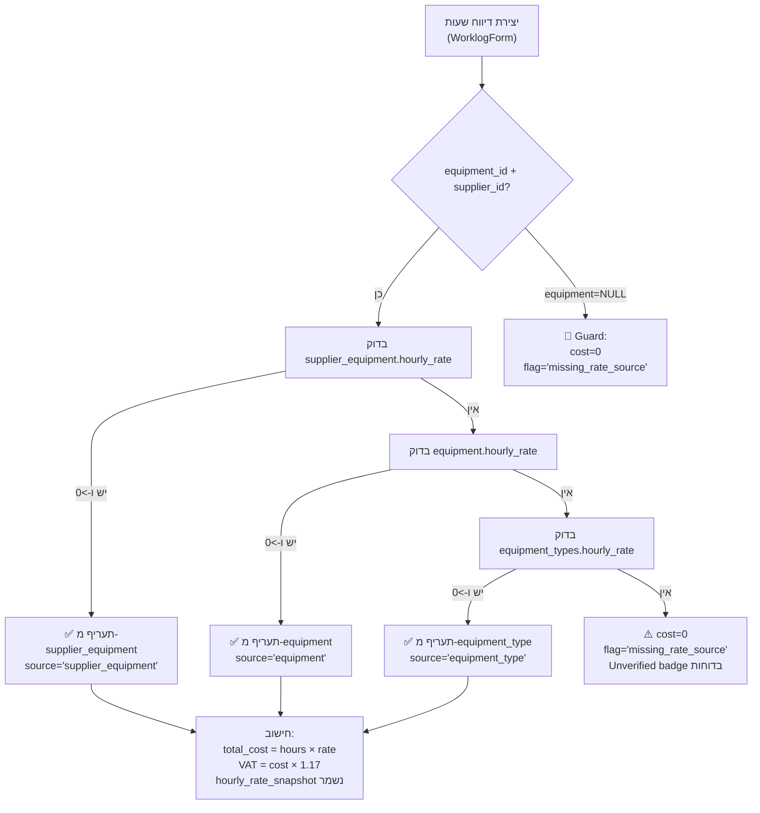

---

## 13. Support Ticket Flow

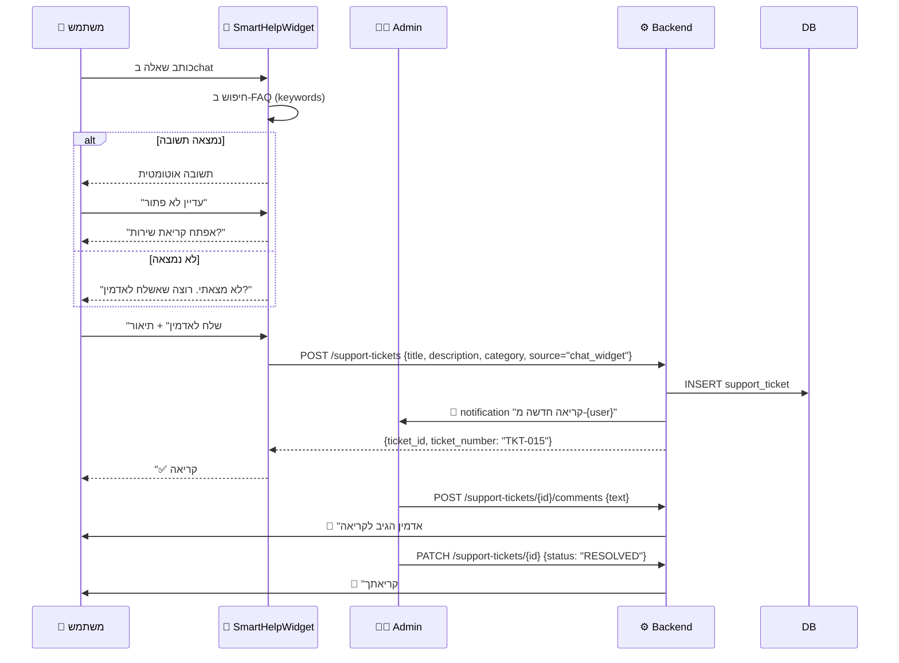
