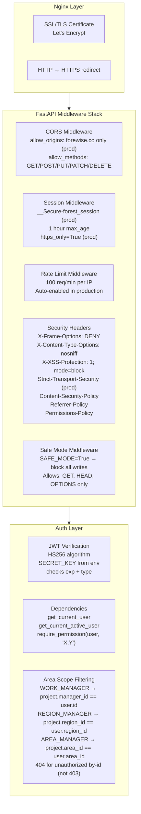

# Security & RBAC — אבטחה והרשאות

## Security Stack



---

## Roles & Permissions Matrix

| Permission | ADMIN | REGION | AREA | WORK | ACCT | COORD | FIELD | VIEWER |
|-----------|:-----:|:------:|:----:|:----:|:----:|:-----:|:-----:|:------:|
| PROJECTS.VIEW | ✅ | ✅ | ✅ | ✅ | ✅ | ✅ | ✅ | ✅ |
| PROJECTS.CREATE | ✅ | ✅ | ✅ | ❌ | ❌ | ❌ | ❌ | ❌ |
| PROJECTS.UPDATE | ✅ | ✅ | ✅ | ❌ | ❌ | ❌ | ❌ | ❌ |
| PROJECTS.DELETE | ✅ | ✅ | ❌ | ❌ | ❌ | ❌ | ❌ | ❌ |
| WORK_ORDERS.VIEW | ✅ | ✅ | ✅ | ✅ | ✅ | ✅ | ❌ | ✅ |
| WORK_ORDERS.CREATE | ✅ | ✅ | ✅ | ✅ | ❌ | ❌ | ❌ | ❌ |
| WORK_ORDERS.UPDATE | ✅ | ✅ | ✅ | ✅ | ❌ | ✅ | ❌ | ❌ |
| WORK_ORDERS.APPROVE | ✅ | ✅ | ✅ | ❌ | ❌ | ✅ | ❌ | ❌ |
| WORK_ORDERS.COORDINATE | ✅ | ✅ | ✅ | ❌ | ❌ | ✅ | ❌ | ❌ |
| WORKLOGS.VIEW | ✅ | ✅ | ✅ | ✅ | ✅ | ❌ | ✅ | ✅ |
| WORKLOGS.CREATE | ✅ | ✅ | ✅ | ✅ | ❌ | ❌ | ✅ | ❌ |
| WORKLOGS.APPROVE | ✅ | ✅ | ✅ | ❌ | ✅ | ❌ | ❌ | ❌ |
| SUPPLIERS.VIEW | ✅ | ✅ | ✅ | ✅ | ✅ | ✅ | ❌ | ✅ |
| SUPPLIERS.UPDATE | ✅ | ✅ | ✅ | ❌ | ❌ | ❌ | ❌ | ❌ |
| EQUIPMENT.VIEW | ✅ | ✅ | ✅ | ✅ | ❌ | ❌ | ✅ | ✅ |
| EQUIPMENT.SCAN | ✅ | ✅ | ✅ | ✅ | ❌ | ❌ | ✅ | ❌ |
| INVOICES.VIEW | ✅ | ✅ | ✅ | ❌ | ✅ | ❌ | ❌ | ✅ |
| INVOICES.APPROVE | ✅ | ✅ | ✅ | ❌ | ✅ | ❌ | ❌ | ❌ |
| BUDGETS.VIEW | ✅ | ✅ | ✅ | ❌ | ✅ | ❌ | ❌ | ✅ |
| BUDGETS.UPDATE | ✅ | ✅ | ✅ | ❌ | ✅ | ❌ | ❌ | ❌ |
| USERS.VIEW | ✅ | ✅ | ❌ | ❌ | ❌ | ❌ | ❌ | ❌ |
| USERS.CREATE | ✅ | ❌ | ❌ | ❌ | ❌ | ❌ | ❌ | ❌ |
| ROLES.CREATE | ✅ | ❌ | ❌ | ❌ | ❌ | ❌ | ❌ | ❌ |
| DASHBOARD.VIEW | ✅ | ✅ | ✅ | ✅ | ✅ | ✅ | ✅ | ✅ |

---

## Token Security

```
Access Token (JWT):
  - Algorithm: HS256
  - TTL: 30 minutes
  - Payload: {sub, email, role, jti, exp, type:"access"}
  - Storage: localStorage (remember) | sessionStorage (session-only)

Refresh Token (JWT):
  - TTL: 7 days (no remember) | 30 days (remember me)
  - Storage: same as access token
  - Use: POST /auth/refresh → new access_token

OTP Token:
  - 6-digit numeric code
  - Stored as: SHA256(code) in DB
  - TTL: 5 minutes
  - Max attempts: 3
  - Rate limit: 60 seconds between requests

Device Token:
  - Format: "dvc_" + secrets.token_urlsafe(32)
  - Stored as: SHA256(token) in DB
  - TTL: 90 days
  - Max per user: 5 (oldest evicted automatically)
  - Revocation: DELETE /auth/devices/{device_id}

Portal Token (Supplier):
  - Format: secrets.token_urlsafe(32)
  - TTL: 3 hours
  - Stored: work_orders.portal_token (plain)
  - Use: single-use (GET + one POST accept/reject)
```

---

## Area-Scope Enforcement

```python
# GET by-id → 404 for unauthorized (not 403)
# This prevents ID enumeration across areas

# LIST → filtered silently
query = db.query(WorkOrder).join(Project)
if user.role.code == "WORK_MANAGER":
    query = query.filter(Project.manager_id == user.id)
elif user.role.code == "REGION_MANAGER":
    query = query.filter(Project.region_id == user.region_id)
elif user.role.code == "AREA_MANAGER":
    query = query.filter(Project.area_id == user.area_id)
# ADMIN/ACCOUNTANT see everything
```

---

## Security Constraints Added (DB Level)

```sql
-- device_tokens hardening
ALTER TABLE device_tokens ADD CONSTRAINT chk_device_expires_after_created
  CHECK (expires_at > created_at);
ALTER TABLE device_tokens ADD CONSTRAINT chk_device_revoked_valid
  CHECK (revoked_at IS NULL OR revoked_at >= created_at);

-- otp_tokens hardening
ALTER TABLE otp_tokens ADD CONSTRAINT chk_otp_expires_after_created
  CHECK (expires_at > created_at);
ALTER TABLE otp_tokens ADD CONSTRAINT chk_otp_attempts_range
  CHECK (attempts >= 0 AND attempts <= 5);

-- work_orders hardening
ALTER TABLE work_orders ALTER COLUMN requested_equipment_model_id SET NOT NULL;
ALTER TABLE work_orders ADD CONSTRAINT fk_work_orders_req_model
  FOREIGN KEY (requested_equipment_model_id) REFERENCES equipment_models(id)
  ON DELETE RESTRICT;

-- Trigger: max 5 active devices per user
CREATE TRIGGER trg_device_tokens_max5
  BEFORE INSERT ON device_tokens
  FOR EACH ROW EXECUTE FUNCTION fn_device_tokens_max5();
```
