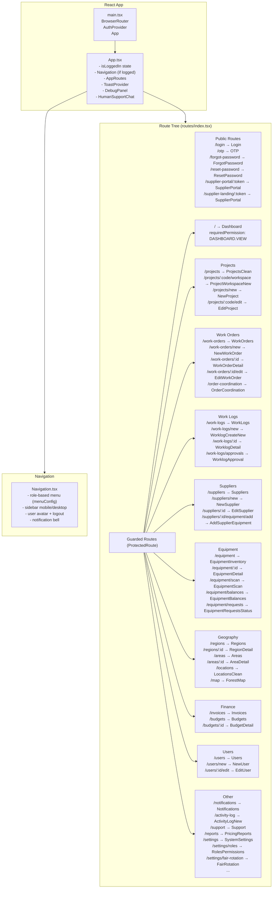
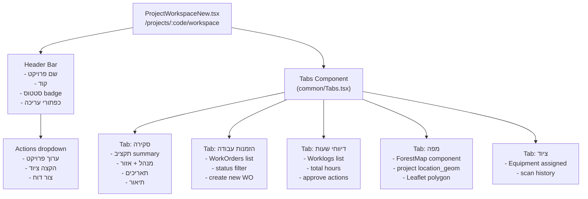
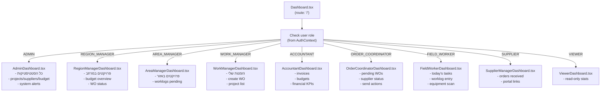
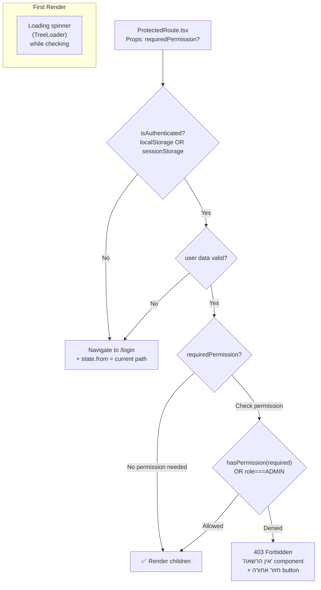
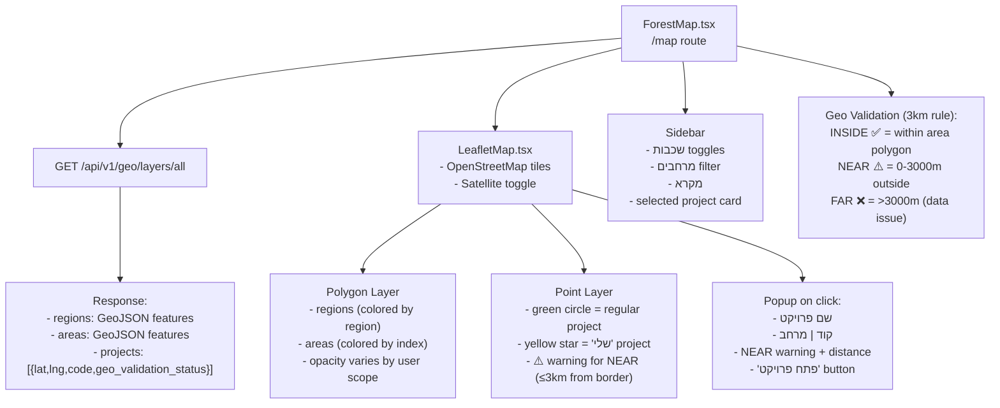
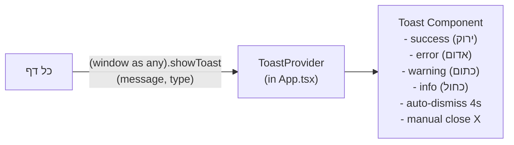

# Component Hierarchy — היררכיית רכיבים

## עץ רכיבים ראשי



---

## ProjectWorkspaceNew — מבנה פנימי



---

## Dashboard — ניתוב לפי Role



---

## ProtectedRoute — auth flow



---

## ForestMap — שכבות גיאוגרפיות



---

## Toast System



---

## Navigation Menu Structure (by role)

```
ADMIN:
  🏠 דשבורד
  🌲 פרויקטים
  📋 הזמנות עבודה
  ⏰ דיווחי שעות
  👷 ספקים
  🚜 ציוד
  💰 חשבוניות
  📊 תקציבים
  🗺️ מפה
  👥 משתמשים
  ⚙️ הגדרות

WORK_MANAGER:
  🏠 דשבורד
  🌲 פרויקטים שלי
  📋 הזמנות עבודה
  ⏰ דיווחי שעות
  🗺️ מפה

ORDER_COORDINATOR:
  🏠 דשבורד
  📋 תיאום הזמנות
  👷 ספקים
  🗺️ מפה

ACCOUNTANT:
  🏠 דשבורד
  💰 חשבוניות
  📊 תקציבים
  📈 דוחות
```
